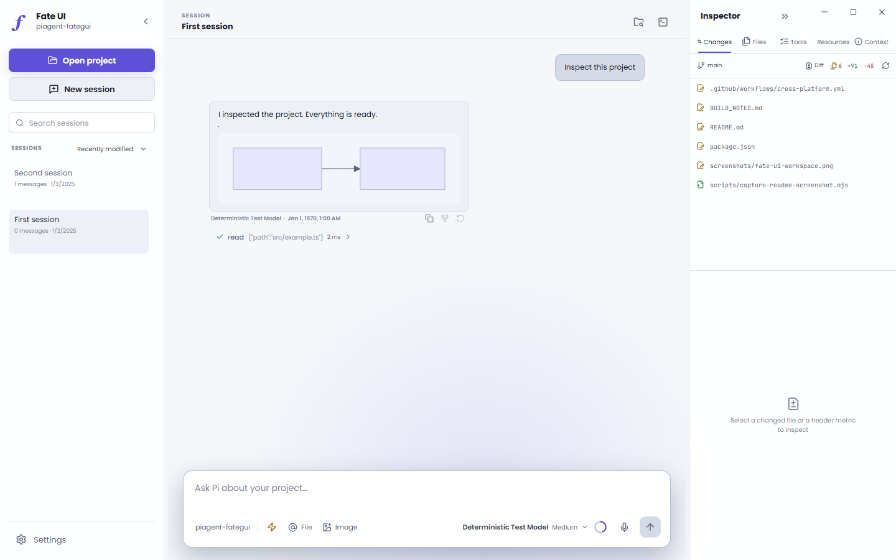
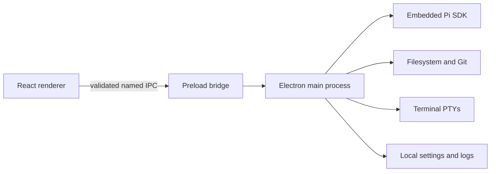

<div align="center">

# Fate UI

### A local-first desktop workspace for Pi Agent

Run Pi in a focused graphical workspace for durable conversations, transparent agent activity, project files, Git, terminals, and explicit trust controls.

[](https://github.com/Master0fFate/pi-fategui/actions/workflows/cross-platform.yml)
[](LICENSE)
[](#installation)
[](https://www.electronjs.org/)

[Latest beta: v0.5.1-beta2](https://github.com/Master0fFate/pi-fategui/releases/tag/v0.5.1-beta2) · [Installation](#installation) · [Capabilities](#what-fate-ui-provides) · [Development](#local-development) · [Security](SECURITY.md) · [Contributing](CONTRIBUTING.md)

</div>



> [!IMPORTANT]
> Fate UI is currently beta software (`0.x` releases). Expect rough edges, and back up important work before relying on it.
>
> Fate UI embeds `@earendil-works/pi-coding-agent`. It does not scrape Pi's terminal UI, and production never substitutes mocked agent responses. Fate UI is an independent community project and is not an official Pi distribution.

## What Fate UI provides

- **The real Pi runtime.** Streamed text, reasoning, tools, sessions, models, skills, prompts, and provider authentication come from the embedded Pi SDK.
- **Local control and explicit trust.** Repositories, sessions, Git, terminals, settings, and credentials stay on your machine. Terminal-opened and manually selected projects get the same **Trust and open**, **Open without Pi**, or **Cancel** choice.
- **Fate Flight Deck.** Activity Pulse reports runtime, queue, context, and change state. Flight Recorder keeps a bounded, navigable history of root, legacy, and team activity. Review Runway pairs diffs and review status with recorded direct-file provenance when available.
- **A focused coding workspace.** One resizable workspace brings together durable sessions, branches and worktrees, project-confined files, Monaco previews and diffs, Git status and history, and a manual terminal. Virtualized timelines, queued messages, guarded project switching, and stop/steer controls keep long-running work responsive.
- **Agent orchestration.** Choose either recursive Agent Teams V2 or isolated legacy subagents, with model, tool, skill, and permission controls.
- **Personal preferences, kept local.** Choose built-in or validated custom themes and interface or code fonts. Use local voice transcription or optional ambient audio when useful.
- **Native installers.** See [Installation](#installation) for published builds, checksum guidance, and platform-specific setup.

## Installation

Download installers and `SHA256SUMS` for published versions from the [GitHub Releases page](https://github.com/Master0fFate/pi-fategui/releases). Published releases include Windows x64, macOS Apple Silicon and Intel, and Linux x64 packages.

> [!NOTE]
> Public beta installers are currently unsigned. Windows SmartScreen or macOS Gatekeeper may display an unknown-publisher warning. Verify the download against `SHA256SUMS` before installation.

### Install on Windows

1. Download `Fate-UI-<version>-Windows-x64.exe`.
2. Run the assisted installer.
3. Keep **Add Fate UI to PATH** selected if you want the `fate` terminal command.
4. Open a **new** terminal after installation.

### Install on macOS

1. Download the `arm64` build for Apple Silicon or the `x64` build for an Intel Mac.
2. Choose either `Fate-UI-<version>-macOS-<arch>.pkg` or `.dmg`.
3. Run the PKG to install Fate UI under `/Applications` and add `fate` under `/usr/local/bin`, or open the DMG and copy the app to Applications.

### Install on Linux

Download `Fate-UI-<version>-Linux-x64.deb` for Debian-based distributions, or the portable `Fate-UI-<version>-Linux-x64.AppImage`.

Install the Debian package with:

```bash
sudo apt install ./Fate-UI-<version>-Linux-x64.deb
```

Or run the AppImage:

```bash
chmod +x Fate-UI-<version>-Linux-x64.AppImage
./Fate-UI-<version>-Linux-x64.AppImage
```

To build an installer from source instead, install the platform prerequisites listed under [Local development](#local-development), check out the desired tag, run `pnpm install --frozen-lockfile`, and then run `pnpm dist` on the target operating system.

## Open a project from the terminal

With the Windows PATH option, a macOS PKG, or a Linux DEB installed:

```bash
cd /path/to/project
fate
```

You can also provide a directory explicitly:

```bash
fate /path/to/project
```

Fate UI opens the canonical directory and displays its normal trust prompt. Every invocation opens an independent window and runtime, even when another installed Fate UI instance is already running. Concurrent processes use separate persistent Electron profile slots while sharing Pi credentials and the session catalog.

## Authenticate Pi

Fate UI reuses Pi's existing provider configuration, OAuth sessions, supported environment credentials, and `~/.pi/agent/auth.json`. Raw API keys are never exposed to renderer state.

1. Install the [Pi coding agent](https://www.npmjs.com/package/@earendil-works/pi-coding-agent) if you do not already use it.
2. Start Pi in a terminal:

   ```bash
   pi
   ```

3. Run `/login` and authenticate a supported provider.
4. Open or restart Fate UI.

Runtime diagnostics still load without credentials, but prompting remains unavailable until Pi reports an authenticated model.

## Permission model

Fate UI starts Pi in project-confined **Edit files** mode.

- **Read only** removes mutation tools.
- **Edit files** confines Pi file operations to the active project.
- **Full access** is intentionally unsandboxed and requires explicit confirmation. Pi can then run shell commands and access host paths with your user account's permissions.

Opening another project resets the active Pi permission level. The manual terminal remains visibly separate from Pi-generated tool activity.

## Agent orchestration

Choose one surface under **Settings > Agent**, then reopen the project. A model sees only the selected surface.

### Agent Teams V2 (beta)

Agent Teams V2 is the recursive, provider-neutral option. A root can create children and children can create grandchildren. The **Agents** inspector shows the tree, task state, profile/model, usage, messages, and writer ownership. It also lets you message, follow up with, interrupt, or close agents. Conversations and events persist under `~/.pi/fateGUI/agent-teams/`; after restart, in-flight work is marked interrupted and retained context can be resumed with a follow-up.

Teams limit depth to 2, non-root nodes to 16, concurrent non-root turns to 3, and write-capable child turns to 1. All agents share the project working tree, so parallel writers are unavailable. Descendant permissions and ordinary tools can only narrow the direct caller's authority.

### Legacy subagents

Legacy mode keeps `subagent`, `subagent_start`, `subagent_manage`, `subagent_workflow`, and `subagent_catalog`. Each child uses an isolated Pi SDK session with its own model, thinking level, profile, permissions, tools, skills, and limits. It cannot launch child agents. Historical snapshots stay readable as direct root children.

Reusable Markdown profiles load from `~/.pi/agent/agents/*.md` and, in trusted projects, `.pi/agents/*.md`. Their frontmatter can define fields such as name, description, role, tools, and model.

## Local development

### Prerequisites

- Node.js **22.19.0 or newer**
- pnpm **11.17.0**
- Git on `PATH`
- A Windows, macOS, or Linux desktop environment
- Build tools for native modules on Linux (`build-essential` and Python 3)

### Setup

```bash
git clone https://github.com/Master0fFate/pi-fategui.git
cd pi-fategui
corepack enable
pnpm install --frozen-lockfile
pnpm dev
```

The development launcher uses an isolated Electron profile, so it can run alongside an installed Fate UI without activating the installed process. The profile is stable per checkout under the operating system's temporary directory. Set `PI_DESKTOP_DEV_PROFILE` to override its location; an explicit `FATE_GUI_DATA_DIR` still overrides Fate's development data directory.

### Verification

```bash
pnpm typecheck       # strict TypeScript
pnpm test            # Vitest unit/integration suite
pnpm test:e2e        # Playwright Electron suite
pnpm verify          # typecheck + tests + E2E
pnpm build           # production main/preload/renderer bundles
pnpm smoke           # production-entry smoke test
pnpm package         # target-native unpacked package + packaged smoke
pnpm dist            # target-native installer artifacts
```

`node-pty`, transcription libraries, and other native dependencies are built or selected on the target operating system. Do not treat cross-compilation as equivalent to a native build.

## Release process

The cross-platform GitHub Actions package matrix runs for pull requests, pushes to `main`, version tags, and non-promotion manual dispatches.

- Native hosted runners build, install or mount, and smoke-test Windows x64, macOS Apple Silicon and Intel, and Linux x64 packages: Windows NSIS, macOS DMG and PKG, Linux AppImage and DEB.
- A release tag must be `v<package.json version>` and point to history contained in `main`.
- After every native job passes, a version tag publishes seven installers and `SHA256SUMS` to its GitHub Release.

## Architecture and security



The renderer has no Node.js, Electron, filesystem, credential, shell, or child-process access. Electron runs with context isolation, sandboxing, web security, denied popups/permissions, and main-frame-only IPC. Project paths are canonicalized and containment-checked in the main process.

Please report vulnerabilities privately according to [SECURITY.md](SECURITY.md). Do not open a public issue for an unpatched security vulnerability.

## Optional media features

- **Voice transcription:** local, settings-controlled models with bounded and verified downloads.
- **Ambient audio:** disabled by default; resolved through a bundled, pinned `yt-dlp` runtime and streamed without saving media into the project.
- **Generated images:** supported model output is rendered inline and copied under `~/.pi/agent/generated-images/<session-id>/`.

See [FONT_LICENSES.md](FONT_LICENSES.md) for bundled font redistribution notices.

## Contributing

Contributions are welcome. Start with [CONTRIBUTING.md](CONTRIBUTING.md), keep changes narrow, preserve the main/renderer security boundary, and include verification evidence with pull requests.

## License, attribution, and project identity

Fate UI is licensed under the [Apache License 2.0](LICENSE). You may use, modify, and redistribute it, including commercially, subject to the license conditions. Distributed modifications must retain applicable copyright, license, trademark, and attribution notices, include the project's [NOTICE](NOTICE), and identify changed files as required by Apache-2.0.

The license does **not** grant permission to use project names, logos, or marks in a way that implies an unmodified official build or endorsement. See [TRADEMARKS.md](TRADEMARKS.md).

Fate UI includes and interoperates with third-party software under its own licenses, including the MIT-licensed Pi coding agent. Required upstream terms are reproduced in [THIRD_PARTY_NOTICES.md](THIRD_PARTY_NOTICES.md). Fate UI remains an independent project.
