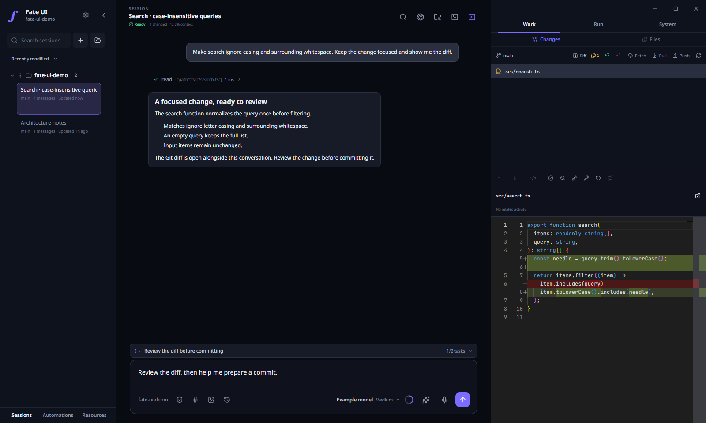
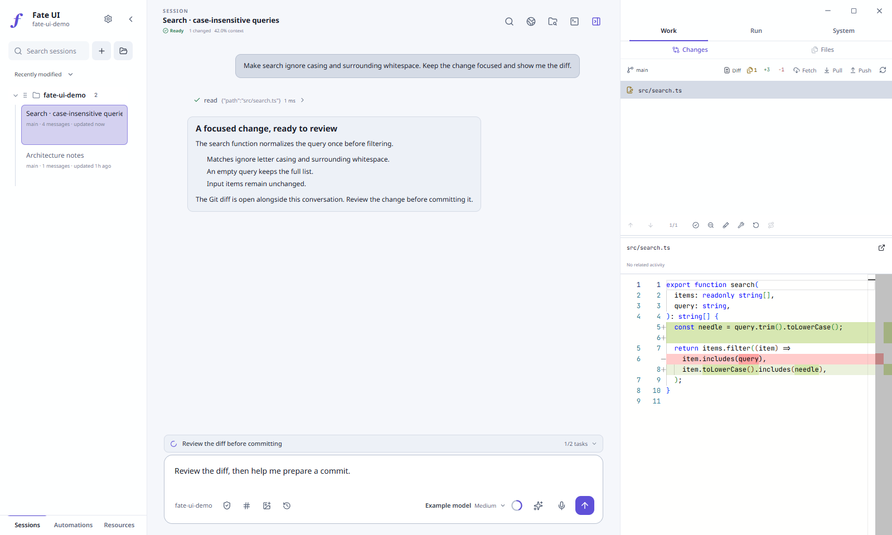

<div align="center">

# Fate UI

### A local-first desktop workspace for Pi Agent

Run the real Pi coding agent in a focused graphical workspace for durable conversations, transparent agent activity, project files, Git, terminals, and explicit trust controls.

[](https://github.com/Master0fFate/pi-fategui/actions/workflows/cross-platform.yml)
[](LICENSE)
[](#get-started-in-60-seconds)
[](https://www.electronjs.org/)

[Latest beta](https://github.com/Master0fFate/pi-fategui/releases) · [Get started](#get-started-in-60-seconds) · [Capabilities](#capabilities) · [Stay safe](#stay-safe) · [Docs](docs/README.md) · [Security](SECURITY.md) · [Contributing](CONTRIBUTING.md)

</div>

<table width="100%">
  <tr>
    <th width="50%" align="center">Dark · Midnight</th>
    <th width="50%" align="center">Light · Daylight</th>
  </tr>
  <tr>
    <td align="center"></td>
    <td align="center"></td>
  </tr>
</table>

## What Fate UI is

Fate UI is a local-first **Electron desktop** workspace for the real Pi coding agent. It embeds `@earendil-works/pi-coding-agent` in the main process — it does not scrape Pi's terminal UI, and production never substitutes mocked agent responses. Repositories, sessions, Git, terminals, settings, and credentials stay on your machine.

Fate UI is an independent community project and is **not** an official Pi distribution.

## SDK-only runtime

Fate UI embeds `@earendil-works/pi-coding-agent` in its Electron main process. It does **not** start, shell out to, or require the `pi` terminal program. Installing Fate UI is enough to run the agent runtime.

| Data | Owner and location |
| --- | --- |
| Provider credentials and model configuration | Fate UI: `~/.pi/fateGUI/` |
| Pi sessions, settings, MCP configuration, skills, and extensions | Shared Pi resources: `~/.pi/agent/` and trusted project resources |

On the first Fate UI run only, existing Pi `auth.json` and `models.json` are copied into the Fate UI provider store. Later Pi Terminal changes do not silently alter Fate UI credentials or models.

> [!IMPORTANT]
> Fate UI is beta software (`0.x` releases). Expect rough edges, and **back up important work before relying on it.** Public beta installers are currently unsigned — verify downloads against `SHA256SUMS` before installation.

## Get started in 60 seconds

### 1. Install

Download installers and `SHA256SUMS` from the [GitHub Releases page](https://github.com/Master0fFate/pi-fategui/releases). Builds cover Windows x64, macOS Apple Silicon and Intel, and Linux x64.

**Windows** — run `Fate-UI-<version>-Windows-x64.exe` and keep **Add Fate UI to PATH** selected for the `fate` command. Open a **new** terminal afterward.

**macOS** — pick the `arm64` (Apple Silicon) or `x64` (Intel) build. Run `Fate-UI-<version>-macOS-<arch>.pkg` to install under `/Applications` and add `fate` under `/usr/local/bin`, or open the `.dmg` and copy the app to Applications.

**Linux** — install the Debian package or run the portable AppImage:

```bash
sudo apt install ./Fate-UI-<version>-Linux-x64.deb      # or:
chmod +x Fate-UI-<version>-Linux-x64.AppImage && ./Fate-UI-<version>-Linux-x64.AppImage
```

Building an installer from source is covered in [Development and release](docs/development.md).

### 2. Connect an AI provider

Fate UI uses its own provider credentials and model configuration under `~/.pi/fateGUI/`. On its first run only, it copies existing `~/.pi/agent/auth.json` and `models.json` when present. It does not copy or alter Pi sessions, settings, MCP configuration, skills, or extensions. Raw API keys are never exposed to renderer state.

1. Open Fate UI and select **Connect your AI**. You can also use `/login` after opening a project.
2. Choose a provider, then complete its OAuth or API-key flow.
3. The available model list refreshes automatically. Select a model, open a trusted project, and start prompting.

Fate UI bundles and runs the Pi SDK directly. You do not need a separate `pi` installation or a running Pi terminal process. Fate UI keeps compatibility with Pi's shared session, settings, MCP, skill, and extension layout through the SDK; this is resource compatibility, not a terminal dependency. Existing provider credentials are imported once on first run; supported environment credentials remain available through the SDK. Runtime diagnostics load without credentials, but prompting is unavailable until Pi reports an authenticated model.

### 3. Launch, trust, and prompt

```bash
cd /path/to/project
fate                       # or: fate /path/to/project
```

Fate UI opens the canonical directory and shows its trust prompt — choose **Trust**, **Open without Pi**, or **Cancel**. Fate UI is **single-instance by default**: a later `fate /path/to/project` launch forwards that folder to the already-running app (opening or focusing it) and exits instead of starting a second process. For multiple synced views of one session, use **File → New Window** (`Ctrl/Cmd+Shift+N`); it reuses the same live runtime. To start a fully isolated second process with its own persistent Chromium profile slot, add `--new-instance` (or set `FATE_NEW_INSTANCE=1`). Pi sessions stay shared; Fate UI provider auth and model configuration stay isolated. See [Sessions and processes](docs/sessions-and-processes.md). Then type your first prompt.

## Capabilities

- **The real Pi runtime.** Streamed text, reasoning, tools, sessions, models, skills, and prompts all come from the embedded Pi SDK — no scraping.
- **Flight Deck observability.** **Activity Pulse** tracks live runtime, queue, context, and changes. The **Activity** timeline joins a live, bounded history of root, legacy, and Agent Team activity (**not a durable audit log**) with the project's direct-write ledger rows. **Review Runway** pairs working-tree diffs with review status and **related direct-file activity**. See [Features](docs/features.md).
- **Agent orchestration.** Recursive Agent Teams V2 or isolated legacy subagents, with per-child model, tools, skills, and permissions. See [Agent orchestration](docs/agent-orchestration.md).
- **First-class Git and files.** Status, history, commits, Monaco diffs, and project-confined file browsing without leaving the app.
- **A manual terminal and an embedded browser** alongside agent activity.
- **Session references and direct session messages.** Attach saved sessions as read-only context, or message a saved session without switching away from your current one.
- **Native media.** Local voice transcription, ambient audio, image generation, and custom themes. See [Features](docs/features.md) and [Themes](docs/themes.md).

## Stay safe

- **Beta.** Fate UI is `0.x` beta software. Back up important work before relying on it.
- **Unsigned installers.** Public beta installers are unsigned; Windows SmartScreen or macOS Gatekeeper may warn. Verify every download against `SHA256SUMS` before installation.
- **Permission model.** Fate UI starts Pi in project-confined **Edit files** mode. **Read only** removes mutation tools. **Full access** is intentionally unsandboxed, requires explicit confirmation, and lets Pi run shell commands and reach host paths with your account's permissions. Opening another project resets the active permission level.
- **Explicit trust.** Every project gets a **Trust / Open without Pi / Cancel** choice. The manual terminal stays visibly separate from Pi-generated tool activity.
- **Credentials stay local.** Fate UI imports Pi credentials only on its first run, then keeps its provider store separate. Raw API keys are never displayed in renderer state.

Full trust, boundary, and hardening detail lives in [Architecture and security](docs/architecture.md) and [SECURITY.md](SECURITY.md).

## Documentation

| If you want to… | Read |
| --- | --- |
| Understand the whole doc set | [Docs index](docs/README.md) |
| Get oriented and open your first project | [Get started](#get-started-in-60-seconds) · [Sessions and processes](docs/sessions-and-processes.md) |
| See what agents are doing | [Features (Flight Deck)](docs/features.md) |
| Author a theme | [Themes](docs/themes.md) |
| Drive Agent Teams or subagents | [Agent orchestration](docs/agent-orchestration.md) |
| Review trust, permissions, and isolation | [Architecture and security](docs/architecture.md) · [SECURITY.md](SECURITY.md) |
| Build, package, or release | [Development and release](docs/development.md) |
| Contribute | [Contributing](CONTRIBUTING.md) |

## Contributing and license

Contributions are welcome. Start with [CONTRIBUTING.md](CONTRIBUTING.md), keep changes narrow, and preserve the main/renderer security boundary.

Fate UI is licensed under the [Apache License 2.0](LICENSE). Distributed modifications must retain applicable copyright, license, trademark, and attribution notices, include the project's [NOTICE](NOTICE), and identify changed files as required by Apache-2.0. The license does **not** grant permission to use project names, logos, or marks in a way that implies an unmodified official build or endorsement — see [TRADEMARKS.md](TRADEMARKS.md). Third-party terms, including the MIT-licensed Pi coding agent, are reproduced in [THIRD_PARTY_NOTICES.md](THIRD_PARTY_NOTICES.md).
