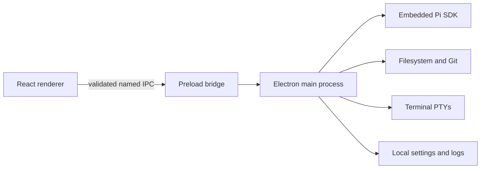

<div align="center">

# Fate UI

### A GUI workbench for Pi Agent

Run Pi in a focused graphical workspace—with durable conversations, transparent tool activity, project files, Git, terminals, and explicit trust controls.

[](https://github.com/Master0fFate/pi-fategui/actions/workflows/cross-platform.yml)
[](LICENSE)
[](#installation)
[](https://www.electronjs.org/)

[Download](#installation) · [Features](#why-fate-ui) · [Development](#local-development) · [Security](SECURITY.md) · [Contributing](CONTRIBUTING.md)

</div>


> [!IMPORTANT]
> Fate UI is currently beta software (`0.x` releases). Expect rough edges, and back up important work before relying on it.
>
> Fate UI embeds `@earendil-works/pi-coding-agent`. It does not scrape Pi's terminal UI, and production never substitutes mocked agent responses. Fate UI is an independent community project and is not an official Pi distribution.

## Why Fate UI?

Fate UI turns Pi into a complete desktop workspace without weakening the local control that makes a coding agent trustworthy.

- **The real Pi runtime** — streamed text, reasoning, tools, sessions, models, skills, prompts, and provider authentication come from the embedded Pi SDK.
- **Local-first by design** — repositories, sessions, Git operations, terminals, settings, and credentials remain on your machine.
- **Explicit project trust** — every terminal-opened or manually selected project goes through the same **Trust and open**, **Open without Pi**, or **Cancel** decision.
- **A serious coding workspace** — browse project files, inspect Monaco previews and diffs, follow tool execution, manage worktrees, and use a separate manual terminal.
- **Make the workspace yours** — choose built-in or validated custom themes, plus interface and code fonts—including a light Daylight theme and Poppins interface type.
- **Private voice input** — record in the composer and turn speech into editable text locally, with a selectable microphone and downloadable, checksum-verified model tiers.
- **Optional ambient audio** — a compact music dock can play user-supplied public HTTPS media or local audio while staying separate from Pi and project activity.
- **Managed multi-model subagents** — Pi can route isolated children to different authenticated providers, reasoning levels, tools, skills, and reusable agent profiles; run dependency workflows; and inspect, steer, retarget, follow up with, or terminate them while Fate UI preserves read-only nested transcripts.
- **Calm during long-running work** — bounded event batches, virtualized timelines, guarded project switching, queued messages, stop/steer controls, and durable sessions keep the interface responsive.
- **Cross-platform beta installers** — tagged releases publish native Windows, macOS, and Linux packages built and installation-smoke-tested on native GitHub runners.

## Highlights

| Workspace | Agent control | Local tooling |
| --- | --- | --- |
| Durable sessions, search, forks, clones, imports, and branches | Streamed output, reasoning, tools, stop, steer, follow-up, and queue editing | Project-confined file browsing, Monaco previews, Git status/history/diffs, and xterm.js terminals |
| Isolated Git worktree sessions | Model, reasoning, and per-session permission controls | Local voice transcription and optional ambient audio |
| Virtualized conversation and tool timelines | Skills, prompt templates, extensions, and generated images | Native menus, shortcuts, settings, diagnostics, and logs |

## Installation

Download installers and `SHA256SUMS` from the [GitHub Releases page](https://github.com/Master0fFate/pi-fategui/releases). New tagged releases publish Windows x64, macOS Apple Silicon and Intel, and Linux x64 builds.

> [!NOTE]
> Public beta installers are currently unsigned. Windows SmartScreen or macOS Gatekeeper may display an unknown-publisher warning. Verify the download against `SHA256SUMS` before installation.

### Install on Windows

1. Download `Fate-UI-<version>-Windows-x64.exe`.
2. Run the assisted installer.
3. Keep **Add Fate UI to PATH** selected if you want the `fate` terminal command.
4. Open a **new** terminal after installation.

### Install on macOS

1. Download the `arm64` build for Apple Silicon or the `x64` build for an Intel Mac.
2. Choose either `Fate-UI-<version>-macOS-<arch>.pkg` or `.dmg`.
3. Run the PKG to install Fate UI under `/Applications` and add `fate` under `/usr/local/bin`, or open the DMG and copy the app to Applications.

### Install on Linux

Download `Fate-UI-<version>-Linux-x64.deb` for Debian-based distributions, or the portable `Fate-UI-<version>-Linux-x64.AppImage`.

Install the Debian package with:

```bash
sudo apt install ./Fate-UI-<version>-Linux-x64.deb
```

Or run the AppImage:

```bash
chmod +x Fate-UI-<version>-Linux-x64.AppImage
./Fate-UI-<version>-Linux-x64.AppImage
```

To build an installer from source instead, install the platform prerequisites listed under [Local development](#local-development), check out the desired tag, run `pnpm install --frozen-lockfile`, and then run `pnpm dist` on the target operating system.

## Open a project from the terminal

With the Windows PATH option, a macOS PKG, or a Linux DEB installed:

```bash
cd /path/to/project
fate
```

You can also provide a directory explicitly:

```bash
fate /path/to/project
```

Fate UI opens the canonical directory and displays its normal trust prompt. Every invocation opens an independent window and runtime, even when another installed Fate UI instance is already running. Concurrent processes use separate persistent Electron profile slots while sharing Pi credentials and the session catalog.

## Authenticate Pi

Fate UI reuses Pi's existing provider configuration, OAuth sessions, supported environment credentials, and `~/.pi/agent/auth.json`. Raw API keys are never exposed to renderer state.

1. Install the [Pi coding agent](https://www.npmjs.com/package/@earendil-works/pi-coding-agent) if you do not already use it.
2. Start Pi in a terminal:

   ```bash
   pi
   ```

3. Run `/login` and authenticate a supported provider.
4. Open or restart Fate UI.

Runtime diagnostics still load without credentials, but prompting remains unavailable until Pi reports an authenticated model.

## Permission model

Fate UI starts Pi in project-confined **Edit files** mode.

- **Read only** removes mutation tools.
- **Edit files** confines Pi file operations to the active project.
- **Full access** is intentionally unsandboxed and requires explicit confirmation. Pi can then run shell commands and access host paths with your user account's permissions.

Opening another project resets the active Pi permission level. The manual terminal remains visibly separate from Pi-generated tool activity.

## Managed subagents

Every top-level Pi session can use five Fate-owned orchestration tools:

- `subagent` runs any explicitly requested number of blocking delegations.
- `subagent_start` launches any explicitly requested number of managed children and returns run IDs immediately.
- `subagent_manage` lists, inspects, waits for, steers, retargets, follows up with, closes, or cancels managed children.
- `subagent_workflow` starts and manages arbitrary acyclic dependency graphs and user-selected concurrency.
- `subagent_catalog` discovers authenticated Pi models, reusable agent profiles, skills, and the child capability contract.

Each child gets an immutable conversation-local handle such as `@auth-reviewer-1` and a renameable display label. Typing `@` opens handle autocomplete, recognized mentions link to the matching inspector session, and exact commands such as `@stop @auth-reviewer-1` remain deterministic. The conversation keeps the real subagent tool call visible as a compact **Running**, **Completed**, **Error**, or **Stopped** marker; detailed activity and controls stay in the **Agents** inspector.

Four concurrent children is planning guidance only when neither the user nor the task specifies a scale. An explicit count is binding: asking for 10 launches 10, and an explicit workflow `maxConcurrency` of 20 schedules 20. Direct batches, workflow nodes, active children, selected skills, routing attempts, and configured durations have no harness policy ceiling. Workflow concurrency defaults to four only when omitted. This follows the liberal shape of [OpenAI's Responses Multi-agent API](https://developers.openai.com/api/docs/guides/responses-multi-agent)—recommended low default, no fixed concurrency/total/depth ceiling—while retaining Fate's independent provider routing and durable desktop inspection. [Claude Code's current dynamic workflows](https://code.claude.com/docs/en/workflows) provide useful scale and resumability patterns, but their documented 16-concurrent/1,000-total runtime caps are intentionally not copied here.

A child can use a different exact `{ provider, id }` than its parent and an independent thinking level. Each specification can also select a profile, role label, permission, exact tool allowlist, Pi skills, timeout, no-activity timeout, ordered model fallbacks, retry count, mailbox lifetime, notification mode, and observable token/cost/turn budget. Timeouts and idle limits are opt-in: omit them or set zero for no automatic stop, including multi-hour work. Fate reuses Pi's main-process model runtime and credentials; no provider secrets cross IPC. Children run in isolated SDK sessions, cannot recursively launch Fate subagents, and receive only the Fate-confined tools allowed by both their requested permission and the parent session's permission. Edit/full-access children perform assigned edits, commands, and verification themselves rather than returning implementation instructions for the parent to repeat.

Cross-agent messages use the receiving model's own context window as their admission boundary. Fate estimates the receiver's current context plus the proposed transfer with Pi's provider-neutral estimator. If it would exceed that model's window, Fate refuses the transfer, names the exact provider/model and maximum token window, preserves the child work in the Agents inspector, and does not compact history merely to force the oversized transfer through. Fixed renderer transcript bounds protect IPC/UI memory only; they do not replace the child model's working context or truncate an admitted final child result.

Managed children can retain their SDK session as a user-configured mailbox for exact follow-up turns. Completion delivery is opt-in: `next-turn` adds model-visible context to a future parent turn, while `immediate` triggers a turn when idle or queues a follow-up when the parent is already streaming. Workflow state and settled child snapshots are persisted with the parent session; an active workflow recovered after restart is paused and must be resumed explicitly.

Reusable Markdown profiles are discovered from `~/.pi/agent/agents/*.md` and, for trusted projects, `.pi/agents/*.md`. Supported frontmatter is intentionally small:

```markdown
---
name: security-reviewer
description: Reviews a change for concrete security regressions
role: reviewer
tools: read, grep, find, ls
model: provider/model-id
---

Review evidence first. Report only actionable findings.
```

The **Agents** inspector shows workflow graphs and each nested run's profile, provider/model, thinking level, authority, skills, attempts, mailbox state, budgets, usage, controls, reasoning, messages, and tool activity. Child transcripts are inspection-only in the renderer; orchestration remains owned by the parent Pi agent.

## Local development

### Prerequisites

- Node.js **22.19.0 or newer**
- pnpm **11.17.0**
- Git on `PATH`
- A Windows, macOS, or Linux desktop environment
- Build tools for native modules on Linux (`build-essential` and Python 3)

### Setup

```bash
git clone https://github.com/Master0fFate/pi-fategui.git
cd pi-fategui
corepack enable
pnpm install --frozen-lockfile
pnpm dev
```

The development launcher uses an isolated Electron profile, so it can run alongside an installed Fate UI without activating the installed process. The profile is stable per checkout under the operating system's temporary directory. Set `PI_DESKTOP_DEV_PROFILE` to override its location; an explicit `FATE_GUI_DATA_DIR` still overrides Fate's development data directory.

### Verification

```bash
pnpm typecheck       # strict TypeScript
pnpm test            # Vitest unit/integration suite
pnpm test:e2e        # Playwright Electron suite
pnpm verify          # typecheck + tests + E2E
pnpm build           # production main/preload/renderer bundles
pnpm smoke           # production-entry smoke test
pnpm package         # target-native unpacked package + packaged smoke
pnpm dist            # target-native installer artifacts
```

`node-pty`, transcription libraries, and other native dependencies are built or selected on the target operating system. Do not treat cross-compilation as equivalent to a native build.

## Release process

The cross-platform GitHub Actions workflow runs for pull requests, pushes to `main`, version tags, and manual dispatches.

- Windows x64, macOS Apple Silicon, macOS Intel, and Linux x64 packages are built on native hosted runners.
- The workflow installs or mounts every output format and launches the packaged app: Windows NSIS, macOS DMG and PKG, Linux AppImage and DEB.
- A version tag such as `v0.1.0-beta.2` must match `package.json` and point to history contained in `main`.
- Only after all native jobs pass does a tag publish the seven installers plus `SHA256SUMS` to its GitHub release.

## Architecture and security



The renderer has no Node.js, Electron, filesystem, credential, shell, or child-process access. Electron runs with context isolation, sandboxing, web security, denied popups/permissions, and main-frame-only IPC. Project paths are canonicalized and containment-checked in the main process.

Please report vulnerabilities privately according to [SECURITY.md](SECURITY.md). Do not open a public issue for an unpatched security vulnerability.

## Optional media features

- **Voice transcription:** local, settings-controlled models with bounded and verified downloads.
- **Ambient audio:** disabled by default; resolved through a bundled, pinned `yt-dlp` runtime and streamed without saving media into the project.
- **Generated images:** supported model output is rendered inline and copied under `~/.pi/agent/generated-images/<session-id>/`.

See [FONT_LICENSES.md](FONT_LICENSES.md) for bundled font redistribution notices.

## Contributing

Contributions are welcome. Start with [CONTRIBUTING.md](CONTRIBUTING.md), keep changes narrow, preserve the main/renderer security boundary, and include verification evidence with pull requests.

## License, attribution, and project identity

Fate UI is licensed under the [Apache License 2.0](LICENSE). You may use, modify, and redistribute it, including commercially, subject to the license conditions. Distributed modifications must retain applicable copyright, license, trademark, and attribution notices, include the project's [NOTICE](NOTICE), and identify changed files as required by Apache-2.0.

The license does **not** grant permission to use project names, logos, or marks in a way that implies an unmodified official build or endorsement. See [TRADEMARKS.md](TRADEMARKS.md).

Fate UI includes and interoperates with third-party software under its own licenses, including the MIT-licensed Pi coding agent. Required upstream terms are reproduced in [THIRD_PARTY_NOTICES.md](THIRD_PARTY_NOTICES.md). Fate UI remains an independent project.

---

<div align="center">

Built for developers who want Pi's power with a transparent, local-first desktop workflow.

</div>
