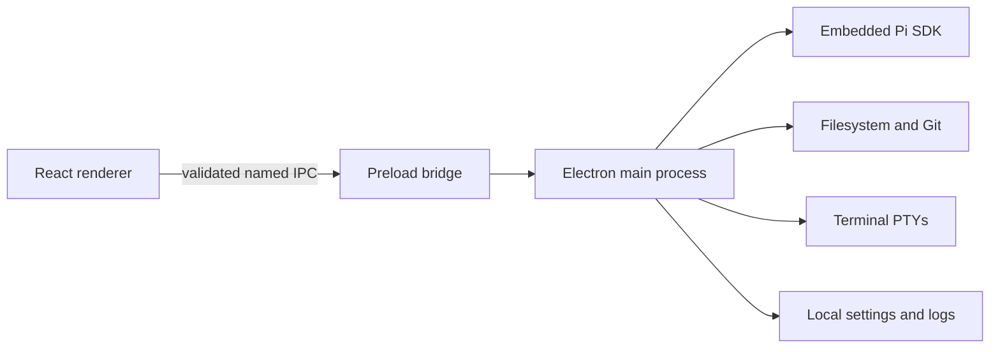

<div align="center">

# Fate UI

### A local-first desktop workbench for the real Pi coding agent

Run Pi in a focused graphical workspace—with durable conversations, transparent tool activity, project files, Git, terminals, and explicit trust controls.

[](https://github.com/Master0fFate/pi-fategui/actions/workflows/cross-platform.yml)
[](LICENSE)
[](#installation)
[](https://www.electronjs.org/)

[Download](#installation) · [Features](#why-fate-ui) · [Development](#local-development) · [Security](SECURITY.md) · [Contributing](CONTRIBUTING.md)

</div>


> [!IMPORTANT]
> Fate UI is currently beta software (`0.x` releases). Expect rough edges, and back up important work before relying on it.
>
> Fate UI embeds `@earendil-works/pi-coding-agent`. It does not scrape Pi's terminal UI, and production never substitutes mocked agent responses. Fate UI is an independent community project and is not an official Pi distribution.

## Why Fate UI?

Fate UI turns Pi into a complete desktop workspace without weakening the local control that makes a coding agent trustworthy.

- **The real Pi runtime** — streamed text, reasoning, tools, sessions, models, skills, prompts, and provider authentication come from the embedded Pi SDK.
- **Local-first by design** — repositories, sessions, Git operations, terminals, settings, and credentials remain on your machine.
- **Explicit project trust** — every terminal-opened or manually selected project goes through the same **Trust and open**, **Open without Pi**, or **Cancel** decision.
- **A serious coding workspace** — browse project files, inspect Monaco previews and diffs, follow tool execution, manage worktrees, and use a separate manual terminal.
- **Make the workspace yours** — choose built-in or validated custom themes, plus interface and code fonts—including a light Daylight theme and Poppins interface type.
- **Private voice input** — record in the composer and turn speech into editable text locally, with a selectable microphone and downloadable, checksum-verified model tiers.
- **Optional ambient audio** — a compact music dock can play user-supplied public HTTPS media or local audio while staying separate from Pi and project activity.
- **Calm during long-running work** — bounded event batches, virtualized timelines, guarded project switching, queued messages, stop/steer controls, and durable sessions keep the interface responsive.
- **Windows beta releases** — native Windows installers are published for tagged beta releases. macOS and Linux users can build verified native packages from source.

## Highlights

| Workspace | Agent control | Local tooling |
| --- | --- | --- |
| Durable sessions, search, forks, clones, imports, and branches | Streamed output, reasoning, tools, stop, steer, follow-up, and queue editing | Project-confined file browsing, Monaco previews, Git status/history/diffs, and xterm.js terminals |
| Isolated Git worktree sessions | Model, reasoning, and per-session permission controls | Local voice transcription and optional ambient audio |
| Virtualized conversation and tool timelines | Skills, prompt templates, extensions, and generated images | Native menus, shortcuts, settings, diagnostics, and logs |

## Installation

### Windows

Download the native Windows installer from the [`v0.1.0-beta.1` GitHub release](https://github.com/Master0fFate/pi-fategui/releases/tag/v0.1.0-beta.1).

> [!NOTE]
> Public Windows beta releases are currently unsigned. Windows SmartScreen may display an unknown-publisher warning. Release assets include `SHA256SUMS` so downloads can be verified independently.

### macOS and Linux

Prebuilt macOS and Linux installers are temporarily unavailable. Build the tagged source on your own **native** macOS or Linux machine; do not cross-compile from Windows. The commands below create a local installer for your platform.

### Install on Windows

1. Download `Fate-UI-<version>-Windows-x64.exe`.
2. Run the assisted installer.
3. Keep **Add Fate UI to PATH** selected if you want the `fate` terminal command.
4. Open a **new** terminal after installation.

### Build on macOS

Install Node.js **22.19.0+**, pnpm **11.17.0**, Git, and Xcode Command Line Tools. Then run:

```bash
git clone --branch v0.1.0-beta.1 https://github.com/Master0fFate/pi-fategui.git
cd pi-fategui
corepack enable
pnpm install --frozen-lockfile
pnpm dist
```

Find the generated `.pkg` and `.dmg` in `release/`. The PKG installs Fate UI under `/Applications` and adds the `fate` command under `/usr/local/bin`; the DMG is portable.

### Build on Linux

On a Linux desktop, install Node.js **22.19.0+**, pnpm **11.17.0**, Git, `build-essential`, and Python 3. Then run:

```bash
git clone --branch v0.1.0-beta.1 https://github.com/Master0fFate/pi-fategui.git
cd pi-fategui
corepack enable
pnpm install --frozen-lockfile
pnpm dist
```

Find the generated `.deb` and `.AppImage` in `release/`. Install the Debian package with:

```bash
sudo apt install ./release/Fate-UI-0.1.0-beta.1-Linux-amd64.deb
```

Or run the portable AppImage:

```bash
chmod +x release/Fate-UI-0.1.0-beta.1-Linux-x86_64.AppImage
./release/Fate-UI-0.1.0-beta.1-Linux-x86_64.AppImage
```

## Open a project from the terminal

With the Windows PATH option, a self-built macOS PKG, or a self-built Linux DEB installed:

```bash
cd /path/to/project
fate
```

You can also provide a directory explicitly:

```bash
fate /path/to/project
```

Fate UI opens the canonical directory and displays its normal trust prompt. If Fate UI is already running, the existing window is focused and the project change is serialized safely against active Pi, Git, and session operations.

## Authenticate Pi

Fate UI reuses Pi's existing provider configuration, OAuth sessions, supported environment credentials, and `~/.pi/agent/auth.json`. Raw API keys are never exposed to renderer state.

1. Install the [Pi coding agent](https://www.npmjs.com/package/@earendil-works/pi-coding-agent) if you do not already use it.
2. Start Pi in a terminal:

   ```bash
   pi
   ```

3. Run `/login` and authenticate a supported provider.
4. Open or restart Fate UI.

Runtime diagnostics still load without credentials, but prompting remains unavailable until Pi reports an authenticated model.

## Permission model

Fate UI starts Pi in project-confined **Edit files** mode.

- **Read only** removes mutation tools.
- **Edit files** confines Pi file operations to the active project.
- **Full access** is intentionally unsandboxed and requires explicit confirmation. Pi can then run shell commands and access host paths with your user account's permissions.

Opening another project resets the active Pi permission level. The manual terminal remains visibly separate from Pi-generated tool activity.

## Local development

### Prerequisites

- Node.js **22.19.0 or newer**
- pnpm **11.17.0**
- Git on `PATH`
- A Windows, macOS, or Linux desktop environment
- Build tools for native modules on Linux (`build-essential` and Python 3)

### Setup

```bash
git clone https://github.com/Master0fFate/pi-fategui.git
cd pi-fategui
corepack enable
pnpm install --frozen-lockfile
pnpm dev
```

### Verification

```bash
pnpm typecheck       # strict TypeScript
pnpm test            # Vitest unit/integration suite
pnpm test:e2e        # Playwright Electron suite
pnpm verify          # typecheck + tests + E2E
pnpm build           # production main/preload/renderer bundles
pnpm smoke           # production-entry smoke test
pnpm package         # target-native unpacked package + packaged smoke
pnpm dist            # target-native installer artifacts
```

`node-pty`, transcription libraries, and other native dependencies are built or selected on the target operating system. Do not treat cross-compilation as equivalent to a native build.

## Release process

Windows beta releases are built and smoke-tested on native Windows, then uploaded directly to their matching Git tag so publishing does not depend on GitHub Actions minutes.

- A beta tag such as `v0.1.0-beta.1` must match `package.json` and point to history contained in `main`.
- The release contains the x64 Windows installer and `SHA256SUMS`.
- The optional Windows package-check workflow runs only when manually dispatched.
- macOS and Linux packages must be built and tested on their respective native platforms before they are published as official artifacts.

## Architecture and security



The renderer has no Node.js, Electron, filesystem, credential, shell, or child-process access. Electron runs with context isolation, sandboxing, web security, denied popups/permissions, and main-frame-only IPC. Project paths are canonicalized and containment-checked in the main process.

Please report vulnerabilities privately according to [SECURITY.md](SECURITY.md). Do not open a public issue for an unpatched security vulnerability.

## Optional media features

- **Voice transcription:** local, settings-controlled models with bounded and verified downloads.
- **Ambient audio:** disabled by default; resolved through a bundled, pinned `yt-dlp` runtime and streamed without saving media into the project.
- **Generated images:** supported model output is rendered inline and copied under `~/.pi/agent/generated-images/<session-id>/`.

See [FONT_LICENSES.md](FONT_LICENSES.md) for bundled font redistribution notices.

## Contributing

Contributions are welcome. Start with [CONTRIBUTING.md](CONTRIBUTING.md), keep changes narrow, preserve the main/renderer security boundary, and include verification evidence with pull requests.

## License, attribution, and project identity

Fate UI is licensed under the [Apache License 2.0](LICENSE). You may use, modify, and redistribute it, including commercially, subject to the license conditions. Distributed modifications must retain applicable copyright, license, trademark, and attribution notices, include the project's [NOTICE](NOTICE), and identify changed files as required by Apache-2.0.

The license does **not** grant permission to use project names, logos, or marks in a way that implies an unmodified official build or endorsement. See [TRADEMARKS.md](TRADEMARKS.md).

Fate UI includes and interoperates with third-party software under its own licenses, including the MIT-licensed Pi coding agent. Required upstream terms are reproduced in [THIRD_PARTY_NOTICES.md](THIRD_PARTY_NOTICES.md). Fate UI remains an independent project.

---

<div align="center">

Built for developers who want Pi's power with a transparent, local-first desktop workflow.

</div>
