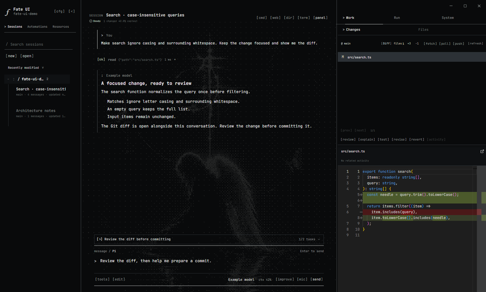

<div align="center">


# Fate UI

### Your coding agent. A workspace you control.

A local-first desktop workspace for the real [Pi coding agent](https://github.com/earendil-works/pi).<br>
Keep conversations, agents, browser context, files, Git, and terminals in one place.

[](#download)
[](LICENSE)
[](https://github.com/Master0fFate/pi-fategui/actions/workflows/cross-platform.yml)

[**Download**](https://github.com/Master0fFate/pi-fategui/releases) · [**Get started**](#get-started-in-60-seconds) · [**Skins**](#skins-and-themes) · [**Documentation**](docs/README.md) · [**Contribute**](CONTRIBUTING.md)

</div>

<picture>
  <source media="(prefers-color-scheme: light)" srcset="screenshots/fate-ui-light.png">
  
</picture>

<p align="center"><sub>Actual Electron interface. Screenshots use a local demonstration project and illustrative agent messages.</sub></p>

## Built for the whole coding session

An agent should not turn your workspace into a black box. Fate UI brings the conversation and the evidence together: see the tools running, inspect the changes, follow delegated work, and decide what happens next.

<table>
<tr>
<td width="50%" valign="top">

### Delegate with clear ownership

Run individual agents or dependency-based workflows through one execution engine. Choose each agent’s model, reasoning effort, tools, and skills. Use shared checkouts or isolated Git worktrees, with explicit review before integration.

[Agents and workflows →](docs/agent-orchestration.md)

</td>
<td width="50%" valign="top">

### Give the agent useful context

Browse inside the workspace, select page elements, and attach browser annotations to the conversation. Add files, images, and saved-session references without losing your place.

[Browser and session context →](docs/features.md)

</td>
</tr>
<tr>
<td valign="top">

### Review the work, not just the answer

Inspect file changes with Monaco diffs, browse Git history, and use the activity timeline to investigate tool actions. A separate manual terminal stays available for your own commands.

[Files, Git, and activity →](docs/features.md)

</td>
<td valign="top">

### Keep longer tasks accountable

GoalMax pairs an objective with completion criteria, progress evidence, and verification. Durable tasks and editable queues make the next steps visible; recovered drafts are not silently resent.

[Goals and durable work →](docs/goalmax.md)

</td>
</tr>
<tr>
<td valign="top">

### Restyle the workspace

**Default**, **Angelcore**, or **M3 Expressive**. Independent palettes and fonts. Import a skin pack, or drop in an image that Fate dithers locally behind the conversation.

[Skins and themes →](#skins-and-themes)

</td>
<td valign="top">

### Voice, images, and memory

Optional local voice transcription, image generation, and ambient audio. Reviewed Memory Learning stores global preferences and project notes you actually accept.

[Memory Learning →](docs/project-learning.md)

</td>
</tr>
</table>

## Skins and themes



<p align="center"><sub>Angelcore, Monochrome, and a personal dithered background. Same conversation and Git diff, different chrome.</sub></p>

You can change how Fate UI looks without changing how it works. Skins restyle the chrome. Colors, fonts, and a background stay independent, so Angelcore can sit on Monochrome, Default can keep a Pi theme, and an imported pack does not rewrite models, permissions, or the session.

<table>
<tr>
<td width="50%" valign="top">

### Skins

**Default** is the established workbench. **Angelcore** is the compact terminal-style surface: text actions, a command composer, labeled transcript entries, and a numeric context gauge. **M3 Expressive** uses a continuous tonal shell, shaped navigation, and a floating composer; its matching dark palette is selected independently. All three remain the same GUI underneath — browser, Monaco, trust prompts, and the manual terminal. See [M3 Expressive design and screenshots](docs/m3-expressive.md).

Import a pack from **Settings → Skins**. Packs can restyle owned surfaces, bundle fonts, and ship a still background. They cannot add scripts, remote assets, or new privileges.

[Skins →](docs/skins.md)

</td>
<td valign="top">

### Color, type, and background

Pick a built-in palette, a custom `themes.json`, or a Pi theme from a trusted project. Interface font and code font are separate.

Drop in a PNG, JPEG, or WebP. Fate converts it on this machine to a still, palette-tinted dither behind the conversation. The original image is not uploaded or kept.

[Themes →](docs/themes.md)

</td>
</tr>
</table>

## Download

Get installers and `SHA256SUMS` from [GitHub Releases](https://github.com/Master0fFate/pi-fategui/releases).

| Platform | Architecture | Installer |
| :-- | :-- | :-- |
| Windows | x64 | `.exe` |
| macOS | Apple Silicon · Intel | `.dmg` or `.pkg` |
| Linux | x64 | `.AppImage` or `.deb` |

> [!IMPORTANT]
> **Installers are currently unsigned; macOS builds are not notarized.** Windows SmartScreen and macOS Gatekeeper may warn or block launch. Download from this repository’s Releases page and verify the artifact against its `SHA256SUMS`. Checksums detect mismatched downloads; they do not replace publisher code signing.

## Get started in 60 seconds

### 1. Install Fate UI

- **Windows:** run the installer. Keep **Add Fate UI to PATH** selected for the `fate` command, then open a new terminal.
- **macOS:** choose your architecture. The `.pkg` installs the app and the `fate` launcher; the `.dmg` lets you copy the app to Applications.
- **Linux:** install the `.deb`, or make the AppImage executable and launch it.

```bash
# Debian / Ubuntu
sudo apt install ./Fate-UI-1.0.0-Linux-x64.deb

# Portable AppImage
chmod +x Fate-UI-1.0.0-Linux-x64.AppImage
./Fate-UI-1.0.0-Linux-x64.AppImage
```

### 2. Connect your provider

Choose **Connect your AI**, or use `/login` in an open project. Sign in using a supported provider’s OAuth flow or API key, then select a model.

You can also add providers from the live **models.dev** catalog. Fate UI keeps provider credentials in the main process; raw keys are not exposed to renderer state.

**No separate Pi terminal installation is required.** Fate UI embeds the Pi SDK directly.

### 3. Open a project and start working

Use **Open project**, or launch from your terminal:

```bash
cd /path/to/project
fate
# Or: fate /path/to/project
```

Review the project trust decision, choose the agent’s permission level, and send a prompt. Inspect tool activity and Git changes as the work progresses.

```text
Inspect this repository and propose a focused plan.
Implement the change, run the relevant checks, and show me what changed.
Preserve existing behavior outside the requested scope.
```

Later `fate` launches reuse the running workspace. **File → New Window** opens another synced view; `--new-instance` creates a separate process/profile when you need one. [Sessions and processes →](docs/sessions-and-processes.md)

## Local-first, with explicit boundaries

Projects, session history, settings, and credentials are stored locally. **Prompts and selected context are sent to the AI provider you configure.** Browser pages, provider discovery, optional downloads, and other network-enabled features also use the network; local-first does not mean offline-only.

| Boundary | What it means |
| :-- | :-- |
| Project trust | Choose **Trust**, **Open without Pi**, or **Cancel** when opening a project. |
| Read only | Project-modification and shell tools are unavailable. |
| Edit files | Agent file operations remain project-confined. |
| Full access | Explicitly unsandboxed access with your account’s permissions. Use deliberately. |
| Agent worktrees | Isolated Git checkouts, **not security sandboxes**. Integration is a separate action. |
| Local credentials | Fate’s provider store is separate from Pi Terminal’s; existing credentials are copied only on first run. |

Keep important work backed up and review changes before merging or deploying. Activity links and local hash records aid investigation; they are not tamper-proof proof of authorship. [Architecture and security →](docs/architecture.md)

Fate UI is an independent community project, not an official Pi distribution.

## Explore the documentation

| You want to… | Start here |
| :-- | :-- |
| Understand the workspace | [Features](docs/features.md) |
| Delegate and review agent work | [Agent orchestration](docs/agent-orchestration.md) |
| Run goals and manage queued work | [GoalMax](docs/goalmax.md) · [Sessions](docs/sessions-and-processes.md) |
| Customize the interface | [Skins](docs/skins.md) · [Themes](docs/themes.md) |
| Review and save useful project knowledge | [Memory Learning](docs/project-learning.md) |
| Build or stage a release | [Development and release](docs/development.md) |
| Report a security issue | [Security policy](SECURITY.md) |

## Build with us

Found a bug or have a focused feature idea? [Open an issue](https://github.com/Master0fFate/pi-fategui/issues). For code contributions, start with [CONTRIBUTING.md](CONTRIBUTING.md). Report vulnerabilities privately through [GitHub Security Advisories](https://github.com/Master0fFate/pi-fategui/security/advisories/new).

Fate UI is licensed under [Apache-2.0](LICENSE). Distribution requirements and third-party attribution are documented in [NOTICE](NOTICE), [THIRD_PARTY_NOTICES.md](THIRD_PARTY_NOTICES.md), and [FONT_LICENSES.md](FONT_LICENSES.md). The license does not grant trademark rights; see [TRADEMARKS.md](TRADEMARKS.md).
