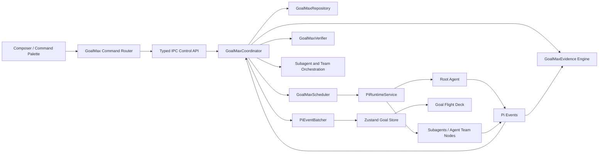

# `/goalmaxxing`: The Full Fate UI Implementation Blueprint

**Research cut-off: 4 August 2026**

## Executive verdict

Do **not** clone Codex `/goal` literally. That would import its weakest design decisions along with its useful persistence model.

Codex Goal mode is not mystical autonomous intelligence. It is a **persisted objective attached to a thread, a lifecycle state machine, a small control-plane API, model-visible goal tools and a continuation policy**. The ChatGPT desktop app currently exposes `/goal <objective>`, `/goal edit`, `/goal pause`, `/goal resume` and `/goal clear`; the objective is retained with the active chat and is capped at 4,000 characters. OpenAI describes the goal text as both the first prompt and the task’s completion criteria. citeturn10view0turn10view1

The valuable part is the durable control plane. The weak part is that progress, continuation and completion still depend too heavily on model behaviour. Public reports show runs spending more than 37 hours and millions of tokens repeatedly planning without delivering the requested interface; stale progress checklists that diverge from actual repository state; background agents that are insufficiently visible; and goal continuations inheriting unclear budget, model or permission settings. citeturn10view6turn12view0turn11view0turn13view0turn13view3

The correct Fate UI design is therefore:

> **A persistent, event-driven, evidence-verified engineering orchestrator that remains active until the objective is completed, explicitly cancelled, genuinely blocked, usage-limited or paused by the user.**

That is `/goalmaxxing`.

It must not be a prompt macro. It must not be a hidden `while (true)` loop. It must not trust the model’s claim that work is complete. It must not flood React with every subagent token. It must not silently invent a budget. It must not hide child execution behind a spinner.

It should be a first-class Fate UI subsystem with:

| Requirement | Non-negotiable behaviour |
|---|---|
| Durability | Survives turn completion, compaction, session switching and application restart |
| Determinism | The slash command is handled by Fate UI’s control plane, never guessed by the model |
| Continuation | Automatically schedules the next useful turn whenever unfinished work becomes idle |
| Completion integrity | Requires observable evidence and verification before marking the goal complete |
| Agent visibility | Every child’s task, status, model, tools, transcript, usage and output are inspectable |
| Responsiveness | Background execution remains separate from foreground chat rendering |
| Steering | User can edit, pause, resume, message children, change constraints or request a checkpoint |
| Honest limits | Budgets, permissions, usage limits and blockers display their exact source |
| Anti-stall control | Detects planning loops, repeated failures, scope drift and zero-progress continuations |
| Crash recovery | Restores an interrupted goal without depending on conversation text |

## How Codex Goal mode actually works

OpenAI publicly graduated Goal mode from experimental status on 21 May 2026 and made it available across the Codex app, IDE extension and CLI. OpenAI explicitly markets it as capable of driving toward an objective for “hours or even days”. citeturn10view3turn10view4

The official user-facing flow is simple:

1. `/goal <objective>` creates or replaces the persistent task objective.
2. The objective becomes the first working prompt and the definition of done.
3. A progress row permits pause, resume, edit and clear.
4. Follow-up messages steer the active goal.
5. A side chat can request an explanation or recap without interrupting the primary execution.
6. Goal mode retains the existing sandbox and approval policy; it does not grant more access merely because the work is long-running.
7. Separate chats can run goals in parallel, with worktrees recommended when tasks might modify overlapping files. citeturn10view1turn10view2

The underlying app-server interface is more revealing. OpenAI’s public Codex app-server documentation exposes:

- `thread/goal/set`
- `thread/goal/get`
- `thread/goal/clear`
- `thread/goal/updated`
- `thread/goal/cleared`

A materialised thread has one persisted goal. Goal state includes the objective, status, token budget, tokens used, elapsed time and timestamps. The documented statuses include conditions such as active, blocked, budget-limited and usage-limited. citeturn10view5

That gives the actual architecture:

```text
Interactive slash command
        │
        ▼
Client-side command dispatcher
        │
        ▼
Thread goal control plane
        │
        ├── persistent goal state
        ├── lifecycle notifications
        ├── usage and time accounting
        └── continuation trigger
                │
                ▼
             Agent turn
                │
                ├── tool work
                ├── child-agent work
                ├── completion proposal
                └── blocked/error report
```

The distinction between **control plane** and **model prompt** matters. An OpenAI collaborator clarified that slash commands are interpreted by interactive clients such as the app or TUI. Sending text beginning with `/goal` through a non-interactive prompt does not reliably invoke Goal mode; it is merely text unless the model independently decides to call a goal tool. citeturn14search5turn13view2

A source-level community analysis of the open-source implementation reports that Codex also tracks token and wall-clock deltas, pauses or resumes around lifecycle events and applies a conservative continuation suppressor when a continuation produces no tool work. In other words, the current implementation is not an unconditional infinite loop: it schedules bounded continuations under specific triggers and can suppress further automatic work after a no-tool turn. This is useful loop protection, but it also explains why users can experience a goal that appears durable while actual execution has quietly stopped progressing. citeturn14search1

That is the central lesson:

> **Persisting a goal and continuously executing a goal are separate problems. Codex solves the first more convincingly than the second.**

A correct Fate UI implementation must explicitly own both.

## What users are actually missing

This plan deliberately does not become a graveyard of isolated bug fixes. The relevant reports are treated as evidence for missing product capabilities.

| Missing capability | Public evidence | `/goalmaxxing` response |
|---|---|---|
| **A genuinely durable execution loop** | A source-level implementation analysis indicates automatic continuation may be suppressed after a no-tool turn. A separate report describes a 37-hour goal that remained active while repeatedly producing plans instead of the requested product. citeturn14search1turn10view6 | Event-driven scheduler with progress detection, phase enforcement, recovery actions and explicit blocked states |
| **Live subagent observability** | Users requested non-blocking background work plus a persistent task panel showing subagents, terminals, elapsed time, output tails, progress and stop controls. citeturn11view0turn11view3 | Goal Flight Deck with live child transcript, tools, model, usage, files, status and controls |
| **Parent-assigned child goals** | A Codex enhancement request asks for parents to assign persisted goals to spawned agents, query child goal state and wait on actual goal completion. citeturn10view8 | Every child lane receives structured criteria and reports evidence against those criteria |
| **Truthful progress** | Codex’s progress checklist can remain stale when implementation and tests are finished because visible state relies on model-issued `update_plan` calls. citeturn12view0 | Progress is reconciled against files, diffs, tests, tools and child results rather than narration alone |
| **Anti-planning-loop enforcement** | A July 2026 report documented repeated specification and planning output, millions of tokens and severe drift away from the requested user-facing deliverable. citeturn10view6 | Planning budget, implementation-phase requirement, artifact deltas, scope-drift detector and independent checkpoint audit |
| **Budget provenance** | A user reported Codex inventing a 180,000-token goal budget that the user had never requested, causing premature termination. citeturn13view0 | Only users or explicit system policy may set budgets; the source is always displayed and persisted |
| **Permission consistency** | A reported goal continuation reused stale permission settings rather than the current visible Full Access configuration. citeturn13view3 | Resolve effective permissions immediately before every continuation and child dispatch |
| **Model and reasoning transparency** | Reports ask for accurate subagent provider visibility, fast-mode inheritance and agreement between requested and effective reasoning effort. citeturn13view4turn13view5turn13view6 | Display requested and effective provider, model, mode and reasoning for every execution lane |
| **Complete goal lifecycle** | Users reported completed goals lingering in thread state without an agent-facing clear or replacement operation. citeturn12view1 | Separate `complete`, `cancel`, `archive`, `clear` and `replace` semantics |
| **Long-brief intake** | Codex rejects source text beyond the 4,000-character persisted-objective limit before normalising it into a concise goal. citeturn13view7turn13view8 | Accept a long brief, derive a bounded objective and structured criteria, then show a preview |
| **Compaction continuity** | A Reddit user reported that after automatic compaction Codex lost track of current state and required the goal to be resent. This is anecdotal, but the failure mode is credible enough to design against. citeturn15search0 | Reinject goal state from the repository after every compaction and session rebind |
| **Deterministic automation** | Codex users requested a control-plane mechanism for headless goal creation because prompt text beginning with `/goal` is model-mediated rather than deterministic. citeturn13view2turn14search5 | Dedicated IPC operations and typed APIs; slash parsing never controls persistence indirectly |

The user statement that they “cannot view what the subagent is doing inside `/goal`” is therefore not a cosmetic complaint. It identifies a structural observability failure. A long-running multi-agent system without a live execution surface is not autonomous engineering; it is an opaque process consuming tokens.

The requested “will not stop until goal is reached” behaviour also needs precision. Blindly looping forever is defective. `/goalmaxxing` should preserve the active objective indefinitely, but execution may pause when:

- user approval is required;
- the environment or provider is unavailable;
- usage is exhausted;
- an explicit user budget is reached;
- a deterministic blocker is detected;
- repeated recovery attempts produce no meaningful progress;
- the user pauses or cancels the run.

In all other unfinished states, the coordinator schedules more work. It never silently decides that “no more tool calls” means the objective has disappeared.

## Why Fate UI is already the better foundation

Fate UI is not starting from zero. Its current architecture is unusually well-suited to this feature.

The repository is an Electron and React desktop application using a main-process Pi runtime, strict IPC contracts, Zustand renderer state, explicit project trust, session management, virtualised timelines, queued steering/follow-up messages, isolated subagents and recursive Agent Teams. The Agent Teams inspector already represents tree structure, tasks, model/profile state, usage, messages, writer ownership and lifecycle controls. fileciteturn2file0L2-L2 fileciteturn4file0L2-L2

The current `PiRuntimeService` already maintains much of the machinery `/goalmaxxing` needs:

- active run identity;
- current objective text;
- queued steering and follow-up messages;
- permission level;
- model and thinking overrides;
- context and token telemetry;
- attention state for background sessions;
- failure state;
- turn phase;
- deferred child notifications;
- multiple live runtime slots;
- subagent and Agent Team coordinators. fileciteturn7file0L2-L2 fileciteturn10file0L2-L2

The current `objective` field is not yet a goal system. It is effectively transient run metadata derived from the active or latest user request. It lacks a durable identifier, lifecycle status, criteria, evidence, revisioning, completion state and crash recovery. fileciteturn11file0L2-L2 fileciteturn18file0L2-L2

Fate UI also already performs one narrow form of continuation. When an assistant response ends because of an output-length limit, the runtime sends a hidden follow-up instructing the model to continue. That mechanism is capped at eight continuations and is disabled when queued user work exists. It solves truncated output, not unfinished goals. fileciteturn7file0L2-L2 fileciteturn13file0L2-L2

The event transport is already built for responsiveness. `PiEventBatcher` coalesces high-frequency root and subagent text/reasoning deltas, defaults to a 32-millisecond batching interval, caps batch size and byte size, and replaces oversized events with a bounded error. fileciteturn27file0L2-L2

The renderer store already indexes messages, reasoning, tools, subagents, Agent Team nodes, tasks and envelopes separately; maintains bounded live histories; and uses event-owned entities rather than repeatedly replacing the entire transcript. fileciteturn22file0L2-L2

The shared contracts are even more useful. Fate UI already defines structured subagent liveness reports containing:

- trigger reason;
- resource or adaptive-limit evidence;
- recent progress;
- turn and node counters;
- timing;
- checkpoint summary;
- recommended actions such as continue, steer, request checkpoint or cancel.

The subagent schema also stores the effective model, routing models, thinking level, tools, transcript, usage, budget and lifecycle data. fileciteturn18file0L2-L2

That means the correct approach is not to bolt a second agent framework onto Fate UI. The correct approach is to place a durable goal coordinator **above the existing Pi runtime, SubagentCoordinator and AgentTeamCoordinator**.

## The `/goalmaxxing` product contract

The command must be a Fate-owned built-in command, not an extension prompt and not ordinary text.

Fate UI currently discovers and filters slash commands generically in the renderer, while prompt submission ultimately goes through the typed `runtime:prompt` IPC path. `/goalmaxxing` should be inserted into the command catalogue but intercepted before normal prompt submission, producing a deterministic goal-control IPC call. fileciteturn15file0L2-L2 fileciteturn21file0L2-L2 fileciteturn26file0L2-L2

The command grammar should be:

| Command | Behaviour |
|---|---|
| `/goalmaxxing <objective>` | Create a goal, compile criteria, show preview and begin |
| `/goalmaxxing` | Open the Goal Flight Deck or show current goal |
| `/goalmaxxing status` | Show objective, phase, criteria, agents, blockers, usage and next action |
| `/goalmaxxing edit` | Edit objective, constraints and acceptance criteria |
| `/goalmaxxing pause [reason]` | Pause future continuations without cancelling active child processes unless selected |
| `/goalmaxxing resume` | Re-resolve permissions and resume unfinished work |
| `/goalmaxxing checkpoint` | Force evidence reconciliation and produce a concise status report |
| `/goalmaxxing verify` | Run the completion gate immediately |
| `/goalmaxxing cancel` | Terminally cancel execution while retaining audit history |
| `/goalmaxxing clear` | Remove a terminal goal from the active session after confirmation |
| `/goalmaxxing replace <objective>` | Archive the current goal and create a new revision lineage |
| `/goalmaxxing agents` | Open the live Agents view |
| `/goalmaxxing budget` | View or explicitly change user-owned token/time limits |

Optional creation flags should remain restrained:

```text
/goalmaxxing
  [--agents auto|off|read-only]
  [--tokens <integer>]
  [--time <duration>]
  [--verify strict|normal]
  <objective>
```

No token or time budget is applied by default. Provider limits and application safety limits are represented separately from user budgets.

The core data model should be approximately:

```ts
export type GoalMaxStatus =
  | 'normalising'
  | 'active'
  | 'paused'
  | 'blocked'
  | 'verifying'
  | 'completed'
  | 'cancelled'
  | 'budget-limited'
  | 'usage-limited'
  | 'failed';

export type GoalMaxPhase =
  | 'intake'
  | 'planning'
  | 'research'
  | 'implementation'
  | 'validation'
  | 'verification'
  | 'handoff';

export interface GoalMaxCriterion {
  id: string;
  title: string;
  description: string;
  required: boolean;
  status: 'pending' | 'active' | 'satisfied' | 'failed' | 'waived';
  evidenceIds: string[];
  ownerNodeIds: string[];
  updatedAt: number;
}

export interface GoalMaxBudget {
  tokenLimit: number | null;
  timeLimitMs: number | null;
  source: 'user-explicit' | 'system-hard-limit' | null;
}

export interface GoalMaxPermissionSnapshot {
  permissionLevel: PermissionLevel;
  projectTrusted: boolean;
  revision: number;
  resolvedAt: number;
}

export interface GoalMaxProgress {
  meaningfulTurnCount: number;
  noProgressTurnCount: number;
  repeatedFailureCount: number;
  planningOnlyTurnCount: number;
  changedFileCount: number;
  latestWorkspaceFingerprint: string;
  latestEvidenceAt: number | null;
}

export interface GoalMaxState {
  id: string;
  sessionId: string;
  projectPath: string;
  revision: number;

  objective: string;
  originalBriefRef: string | null;
  originalBriefHash: string | null;

  status: GoalMaxStatus;
  phase: GoalMaxPhase;
  executionState: 'idle' | 'running-root' | 'running-children' | 'waiting';

  criteria: GoalMaxCriterion[];
  budget: GoalMaxBudget;
  permission: GoalMaxPermissionSnapshot;

  progress: GoalMaxProgress;
  evidence: GoalMaxEvidence[];
  continuation: GoalMaxContinuationState;
  childAssignments: GoalMaxChildAssignment[];

  tokensUsed: number;
  elapsedMs: number;

  createdAt: number;
  updatedAt: number;
  startedAt: number | null;
  completedAt: number | null;

  blockedReason: string | null;
  failure: AppError | null;
}
```

The lifecycle must be explicit:

```text
normalising
     │
     ▼
   active ───────────────► verifying ───────────────► completed
     │                         │
     │                         └── failed gate ─────► active
     │
     ├──► paused ─────────────► active
     ├──► blocked ────────────► active
     ├──► budget-limited ─────► active after budget extension
     ├──► usage-limited ──────► active after availability returns
     ├──► failed ─────────────► active after retry
     └──► cancelled
```

The following invariants should be hard-coded, not merely placed in a system prompt:

- Only the control plane creates, replaces, pauses, cancels or clears a goal.
- The model may report progress, blockers and a completion candidate.
- The model cannot silently create a budget.
- The model cannot elevate permissions.
- The model cannot mark a criterion satisfied without evidence.
- A completion candidate always enters `verifying`.
- A goal cannot be `completed` while required criteria remain pending or failed.
- A new goal may replace a completed goal without leaving the session permanently stuck.
- Every mutation increments `revision`.
- Continuation jobs carry the expected goal revision and are dropped if stale.
- A session may have one current goal and any number of archived historical goals.
- Compaction never owns the authoritative goal state.

The intake path should accept both concise objectives and giant briefs. For a brief beyond the stored objective limit:

1. Preserve the draft.
2. Resolve referenced project files.
3. Ask a one-shot normaliser to produce:
   - a concise objective;
   - constraints;
   - explicit deliverables;
   - verification criteria;
   - exclusions and non-goals.
4. Display the result before activation.
5. Store only the bounded objective and structured criteria in the hot continuation context.
6. Store the original brief by file reference or bounded archived payload, plus a hash for integrity.

This fixes the false equivalence between “maximum persisted objective length” and “maximum source brief length” exposed by Codex’s 4,000-character flow. citeturn13view7turn13view8

## Engineering implementation plan

The implementation should be delivered as a coherent subsystem, not scattered conditionals inside `PiRuntimeService`.

The target architecture is:



**Shared contracts**

Create `src/shared/contracts/goalmaxxing.ts` and keep goal-specific schemas out of the already massive general IPC file.

It should define:

- state, criterion, evidence and child-assignment schemas;
- control input schemas;
- mutation result schemas;
- event schemas;
- repository snapshot versions;
- bounded text, array and history limits;
- migration functions for future schema versions.

Modify `src/shared/contracts/ipc.ts` to add only the channels and exported aggregate types:

```ts
runtimeGoalMaxGet
runtimeGoalMaxCreate
runtimeGoalMaxControl
runtimeGoalMaxUpdate
runtimeGoalMaxClear
runtimeGoalMaxEvents
```

Suggested API:

```ts
interface PiDesktopApi {
  getGoalMax(): Promise<GoalMaxState | null>;
  createGoalMax(input: GoalMaxCreateInput): Promise<GoalMaxState>;
  controlGoalMax(input: GoalMaxControlInput): Promise<GoalMaxState | null>;
  updateGoalMax(input: GoalMaxUpdateInput): Promise<GoalMaxState>;
}
```

Modify `src/preload/api.ts` to parse both inputs and outputs at the isolation boundary, following the existing runtime API pattern. Fate UI already validates IPC calls with Zod on both sides; goal operations must keep that boundary intact. fileciteturn17file0L2-L2 fileciteturn19file0L2-L2 fileciteturn21file0L2-L2

**Persistent repository**

Add:

```text
src/main/pi/goalmaxxing/GoalMaxRepository.ts
src/main/pi/goalmaxxing/GoalMaxMigrations.ts
src/main/pi/goalmaxxing/GoalMaxJournal.ts
```

Use an authoritative atomic JSON snapshot per project/session and an append-only audit journal:

```text
<app-data>/goalmaxxing/v1/<project-hash>/<session-id>/
  current.json
  events.jsonl
  archive/
```

Every write should:

1. acquire a per-session mutation lock;
2. verify expected revision;
3. write a temporary snapshot;
4. flush and atomically rename it;
5. append a bounded audit event;
6. emit the committed revision;
7. optionally append a portable `fate-goalmax-event` custom entry to the Pi session manager.

The dedicated snapshot prevents goal recovery from requiring a full conversation replay. The session custom entries preserve portability and debugging history, matching the existing pattern used for persisted subagent and Agent Team snapshots. fileciteturn10file0L2-L2

On startup or session switch:

- load the current snapshot;
- validate project path and session identity;
- migrate schema if required;
- mark an unfinished `running-*` execution as `active/idle`;
- reconcile child runs still known to the coordinators;
- refresh permissions;
- schedule recovery only after the renderer and runtime binding are ready.

**Coordinator**

Add:

```text
src/main/pi/goalmaxxing/GoalMaxCoordinator.ts
src/main/pi/goalmaxxing/GoalMaxStateMachine.ts
src/main/pi/goalmaxxing/GoalMaxCommand.ts
```

`GoalMaxCoordinator` owns all lifecycle mutations. `PiRuntimeService` should delegate to it rather than implementing goal semantics directly.

Responsibilities:

- creation and normalisation;
- criterion compilation;
- pause, resume, cancel, clear and replace;
- runtime binding and re-binding;
- continuation scheduling;
- child assignment linkage;
- progress and evidence reconciliation;
- budget and usage accounting;
- completion verification;
- event emission;
- crash recovery.

The coordinator should receive narrow adapters:

```ts
interface GoalMaxRuntimeAdapter {
  getSessionState(sessionId: string): RuntimeState;
  promptContinuation(sessionId: string, text: string): Promise<PromptAcceptance>;
  sendSteer(sessionId: string, text: string): Promise<PromptAcceptance>;
  abortRoot(sessionId: string): Promise<boolean>;
  resolvePermission(sessionId: string): Promise<PermissionLevel>;
  getSubagents(sessionId: string): SubagentRun[];
  getAgentTeam(sessionId: string): AgentTeam | null;
  controlSubagent(input: SubagentControlInput): Promise<void>;
  controlAgentTeam(input: AgentTeamControlInput): Promise<void>;
}
```

This keeps the goal engine independently testable.

**Deterministic slash-command routing**

Create:

```text
src/renderer/features/goalmaxxing/parseGoalMaxCommand.ts
src/renderer/features/goalmaxxing/GoalMaxCommandDialog.tsx
```

Modify:

```text
src/renderer/features/chat/Composer.tsx
src/renderer/features/chat/slashCommands.ts
src/main/pi/PiRuntimeService.ts
```

Add a synthetic command descriptor:

```ts
{
  name: 'goalmaxxing',
  description: 'Run a persistent, visible, verified engineering goal',
  source: 'builtin'
}
```

Before calling `window.pi.prompt`, the Composer should parse a command only when:

- it begins at the start of the draft;
- the exact command is `/goalmaxxing`;
- it is not inside pasted code;
- parsing succeeds against a strict grammar.

The command handler calls the goal IPC API. It never forwards `/goalmaxxing` as ordinary model text.

Creation should open a preview dialog showing:

- objective;
- generated criteria;
- inferred constraints;
- proposed agent strategy;
- verification level;
- explicit token/time budget, if any;
- permission level;
- files or resources referenced.

**Continuation scheduler**

Add:

```text
src/main/pi/goalmaxxing/GoalMaxScheduler.ts
src/main/pi/goalmaxxing/GoalMaxContinuationPrompt.ts
src/main/pi/goalmaxxing/GoalMaxTurnLease.ts
```

The scheduler must be event-driven.

Do not implement:

```ts
while (!complete) {
  await session.prompt("continue");
}
```

That creates duplicate turns, stale-state races and unbounded token waste.

Use triggers:

- root `agent_settled`;
- all required child assignments settled;
- child result delivered;
- user resume;
- permission approval;
- provider availability restored;
- goal creation or edit;
- verification failure;
- explicit retry;
- application recovery.

Core pseudocode:

```ts
async function maybeContinue(goalId: string, expectedRevision: number) {
  const goal = await repository.get(goalId);

  if (!goal || goal.revision !== expectedRevision) return;
  if (goal.status !== 'active') return;
  if (goal.executionState !== 'idle') return;
  if (runtime.hasForegroundTurn(goal.sessionId)) return;
  if (runtime.hasQueuedUserMessage(goal.sessionId)) return;

  const permission = await runtime.resolvePermission(goal.sessionId);
  await coordinator.reconcilePermission(goal, permission);

  const progress = await evidenceEngine.reconcile(goal);

  if (progress.completionCandidate) {
    await coordinator.beginVerification(goal.id);
    return;
  }

  const recovery = stallDetector.decide(goal, progress);

  if (recovery.kind === 'blocked') {
    await coordinator.block(goal.id, recovery.reason);
    return;
  }

  const lease = await leases.acquire(goal.id, goal.revision);
  if (!lease) return;

  try {
    await runtime.promptContinuation(
      goal.sessionId,
      continuationPrompt.build(goal, progress, recovery),
    );
  } finally {
    await lease.release();
  }
}
```

A continuation turn must receive a bounded, structured context:

```text
ACTIVE GOAL
Objective: ...

CURRENT PHASE
Implementation

REQUIRED CRITERIA
- [satisfied] ...
- [active] ...
- [pending] ...

RECENT VERIFIED PROGRESS
- Files changed...
- Test result...
- Child lane result...

CURRENT BLOCKERS
None

NEXT-TURN CONTRACT
Perform the highest-value concrete action that advances an unsatisfied criterion.
Do not produce another plan unless new uncertainty requires it.
Use tools and modify or verify artefacts.
If blocked, report the exact blocker.
If all criteria appear satisfied, request verification rather than claiming completion.
```

**Anti-stall and scope-drift engine**

Add:

```text
src/main/pi/goalmaxxing/GoalMaxProgressEngine.ts
src/main/pi/goalmaxxing/GoalMaxStallDetector.ts
src/main/pi/goalmaxxing/GoalMaxScopeGuard.ts
```

Meaningful progress should be based on deltas such as:

- repository tree changes;
- Git diff hash;
- changed-file count;
- successful test/build/lint runs;
- criterion evidence added;
- child assignment completed;
- blocker removed;
- failing test count reduced;
- required artefact created;
- user-visible application state verified;
- new, relevant investigation result.

Do not count these as meaningful progress by themselves:

- another plan;
- another architecture document;
- rephrased status;
- repeated file reading;
- identical failing command;
- repeated request for the same unavailable permission;
- a child summary with no evidence;
- changing internal task labels without repository change.

Recommended escalation:

| Condition | Coordinator response |
|---|---|
| One zero-progress turn | Add a strong concrete-action instruction |
| Two consecutive zero-progress turns | Force a progress reconciliation and prohibit another planning-only turn |
| Three zero-progress turns | Spawn a read-only diagnostic reviewer to identify the blocker or wrong approach |
| Four zero-progress turns | Roll back to the last useful checkpoint or change execution strategy |
| Five zero-progress turns | Mark `blocked`, preserve the active goal and request a user decision |
| Repeated planning after implementation phase begins | Reject planning-only continuation and require an artefact-producing action |
| Scope movement away from required deliverables | Inject original objective and violated criterion into the next turn |
| Repeated identical failure | Require root-cause diagnosis before retry |
| Child lane produces no evidence | Return assignment for correction rather than accepting its summary |

The goal remains persisted while blocked. It has not “stopped” in the destructive sense; it is waiting with an explicit reason and recovery options.

**Evidence and completion verification**

Add:

```text
src/main/pi/goalmaxxing/GoalMaxEvidenceEngine.ts
src/main/pi/goalmaxxing/GoalMaxVerifier.ts
src/main/pi/goalmaxxing/GoalMaxVerificationProfile.ts
```

Evidence types should include:

```ts
type GoalMaxEvidence =
  | FileEvidence
  | GitDiffEvidence
  | CommandEvidence
  | TestEvidence
  | BuildEvidence
  | LintEvidence
  | ScreenshotEvidence
  | RuntimeEvidence
  | SubagentEvidence
  | UserApprovalEvidence;
```

Each evidence item stores:

- source;
- criterion IDs;
- timestamp;
- command or tool provenance;
- exit code where relevant;
- bounded output;
- file hashes;
- whether it remains current;
- invalidation conditions.

A model statement such as “tests pass” is not evidence. A recorded command invocation with exit code zero is evidence.

Completion flow:

1. Root agent requests completion.
2. Coordinator sets `verifying`.
3. Progress engine refreshes workspace state.
4. Required verification commands execute.
5. An independent read-only verification agent receives:
   - original objective;
   - criteria;
   - changed files;
   - diffs;
   - test evidence;
   - exclusions;
   - no access to the root agent’s confidence statement.
6. Verifier returns structured pass/fail findings.
7. Failed findings become active criteria and the goal returns to `active`.
8. All hard criteria passing moves the goal to `completed`.
9. Completion records a final evidence manifest and concise hand-off report.

This directly fixes stale model-authored progress and planning-loop completion theatre.

**Subagent goal assignments**

Extend the current subagent and Agent Team metadata with:

```ts
interface GoalMaxChildAssignment {
  id: string;
  goalId: string;
  nodeId: string;
  criterionIds: string[];

  lane:
    | 'research'
    | 'implementation'
    | 'tests'
    | 'review'
    | 'verification'
    | 'documentation';

  objective: string;
  expectedArtifacts: string[];
  writeScope: string[];
  status:
    | 'pending'
    | 'running'
    | 'blocked'
    | 'completed'
    | 'failed'
    | 'cancelled';

  requestedModel: ModelInfo | null;
  effectiveModel: ModelInfo | null;
  requestedThinking: ThinkingLevel | null;
  effectiveThinking: ThinkingLevel | null;

  evidenceIds: string[];
  startedAt: number | null;
  endedAt: number | null;
}
```

The parent can assign criteria to a child, query progress and wait for evidence-backed completion. A child cannot satisfy the parent goal merely by returning a prose summary.

For each child, the UI must show both requested and effective execution policy. This eliminates the ambiguity reflected in Codex reports where the displayed provider or reasoning level differed from the effective child runtime. citeturn13view4turn13view6

Reuse Fate UI’s existing one-writer policy for shared working directories. Parallel read-only investigation is encouraged; parallel writing is permitted only when scopes are disjoint or the work is isolated in separate worktrees. Fate UI already has worktree operations and Agent Team writer-ownership concepts, so `/goalmaxxing` should orchestrate those rather than inventing unsafe concurrent editing. fileciteturn2file0L2-L2 fileciteturn19file0L2-L2

**Goal Flight Deck**

Add:

```text
src/renderer/features/goalmaxxing/GoalMaxRail.tsx
src/renderer/features/goalmaxxing/GoalMaxInspector.tsx
src/renderer/features/goalmaxxing/GoalMaxOverview.tsx
src/renderer/features/goalmaxxing/GoalMaxCriteria.tsx
src/renderer/features/goalmaxxing/GoalMaxAgents.tsx
src/renderer/features/goalmaxxing/GoalMaxEvidence.tsx
src/renderer/features/goalmaxxing/GoalMaxTimeline.tsx
src/renderer/features/goalmaxxing/GoalMaxControls.tsx
src/renderer/stores/goalMaxStore.ts
```

The compact rail above the composer should show:

```text
GOALMAXXING · ACTIVE · IMPLEMENTATION
7 / 11 criteria · 3 agents running · 184k tokens · 48m
[Pause] [Checkpoint] [Agents] [Edit] [Cancel]
```

The inspector should have stable tabs:

| View | Content |
|---|---|
| Overview | Objective, phase, elapsed time, token use, permission, next action, blockers |
| Criteria | Every acceptance criterion, owner, evidence and status |
| Agents | Root and child tree with live status and controls |
| Terminals | Commands, elapsed runtime, output tail and stop action |
| Evidence | Files, diffs, test/build results, screenshots and verification findings |
| Timeline | Goal lifecycle events, continuations, edits, checkpoints and state transitions |

Selecting a child must expose:

- display name and role;
- assigned objective;
- owned criteria;
- requested and effective provider/model;
- requested and effective thinking level;
- permission and tools;
- current action;
- elapsed runtime;
- token and cost telemetry;
- live assistant output;
- reasoning when the runtime provides it;
- tool invocations and bounded output;
- files touched;
- latest evidence;
- mailbox;
- message, steer, interrupt, retry and close controls.

The root chat must not be polluted with every child token. Child output belongs in the child inspector. Only significant lifecycle reports should enter the root timeline:

- child started;
- child blocked;
- child completed;
- child failed;
- evidence delivered;
- parent action required.

**Lag-free rendering**

The current batcher and indexed renderer store are the right base, but `/goalmaxxing` should add explicit performance policy. fileciteturn27file0L2-L2 fileciteturn22file0L2-L2

Implement:

- selected child stream updates at the existing low-latency cadence;
- non-selected child text aggregated at roughly 100–250 milliseconds;
- collapsed children receiving only summary counters until opened;
- separate goal metadata events from text-stream events;
- fixed-size ring buffers for child transcript entities;
- virtualised agent, evidence and timeline lists;
- selector-level Zustand subscriptions;
- no replacement of the full goal object on token deltas;
- persistence batching at most once per second during streaming, with immediate flush on lifecycle transitions;
- bounded tool output and image memory;
- lazy hydration of historical child transcripts;
- worker-thread hashing for large workspace fingerprints where necessary;
- no synchronous Git-wide scans on every token;
- no React component subscribed to the entire runtime store.

Suggested goal events:

```ts
type GoalMaxEvent =
  | { type: 'goalmax.snapshot'; goal: GoalMaxState }
  | { type: 'goalmax.status'; goalId: string; status: GoalMaxStatus }
  | { type: 'goalmax.phase'; goalId: string; phase: GoalMaxPhase }
  | { type: 'goalmax.criterion'; goalId: string; criterion: GoalMaxCriterion }
  | { type: 'goalmax.assignment'; goalId: string; assignment: GoalMaxChildAssignment }
  | { type: 'goalmax.evidence'; goalId: string; evidence: GoalMaxEvidence }
  | { type: 'goalmax.usage'; goalId: string; tokensUsed: number; elapsedMs: number }
  | { type: 'goalmax.heartbeat'; goalId: string; summary: GoalMaxHeartbeat }
  | { type: 'goalmax.cleared'; sessionId: string };
```

Do not emit the complete `GoalMaxState` for every token or heartbeat.

**Permission and policy correctness**

Every automatic continuation must resolve the current effective permission immediately before dispatch. The continuation should carry:

- goal revision;
- permission revision;
- model selection revision;
- thinking-level revision;
- project generation;
- session generation.

If any revision changes before prompt acceptance, discard and rebuild the continuation.

Goal mode never elevates project trust or permission. A permission denial yields `blocked`, not a hidden retry storm. This aligns with OpenAI’s documented principle that starting a goal does not broaden sandbox access. citeturn10view2

Budgets must expose:

```text
Tokens used:        184,220
User token limit:   none
System hard limit:  provider-managed
Elapsed:            48m 12s
Budget source:      none
```

A child may request more budget, but cannot create it. The user controls budget changes.

**Compaction and session recovery**

On `compaction_end`, session rebind or history hydration:

1. Load authoritative goal state from `GoalMaxRepository`.
2. Regenerate a bounded goal capsule.
3. Inject the capsule into the next model turn independently of chat history.
4. Reconcile changed files and evidence invalidated since the last snapshot.
5. Restore child assignments from the coordinators.
6. Resume only when the status is active and the runtime is idle.

The goal capsule should contain the objective, unsatisfied criteria, latest evidence, blockers and next phase—not the entire historical transcript.

**Integration points**

Modify these existing files:

| File | Change |
|---|---|
| `src/shared/contracts/ipc.ts` | Add channels and exported goal types |
| `src/preload/api.ts` | Expose validated goal-control API |
| `src/main/ipc/registerIpc.ts` | Register main-process handlers |
| `src/main/pi/PiRuntimeService.ts` | Bind coordinator to session lifecycle, prompts, compaction and child events |
| `src/main/pi/PiEventBatcher.ts` | Support bounded goal-event batching where needed |
| `src/renderer/features/chat/Composer.tsx` | Deterministic command interception and goal rail |
| `src/renderer/features/chat/slashCommands.ts` | Built-in command source and autocomplete |
| `src/renderer/stores/runtimeStore.ts` | Forward goal events or coexist with a dedicated goal store |
| `src/renderer/app/App.tsx` | Mount Goal Flight Deck |
| `src/renderer/features/shell/ContextPanel.tsx` | Add Goal inspector surface |
| `src/renderer/features/shell/flightDeck.ts` | Add goal activity and attention derivation |
| `src/renderer/features/shell/SubagentControls.tsx` | Add criterion assignment and goal-aware child actions |
| `src/shared/contracts/multiAgent.ts` | Add goal linkage to nodes/tasks |
| `tests/e2e/FakePiRuntimeService.ts` | Simulate persistent goals and continuations |

The existing main/preload/renderer separation should remain intact. The goal scheduler belongs in the main process, not in React. fileciteturn6file0L2-L2

## Verification, performance gates and delivery sequence

The implementation is not complete when the command appears in autocomplete. It is complete when the system survives hostile lifecycle conditions and proves that it can progress without freezing or lying.

**Unit gates**

The test suite must cover:

- strict command parsing;
- long-brief normalisation;
- criterion compilation bounds;
- every legal and illegal state transition;
- revision compare-and-swap;
- stale continuation rejection;
- duplicate scheduler trigger suppression;
- session and project generation changes;
- pause during root turn;
- pause while children are running;
- resume with changed permissions;
- explicit and absent budgets;
- refusal of model-inferred budget;
- completion proposal with missing evidence;
- evidence invalidation after file changes;
- planning-loop detection;
- repeated-command failure detection;
- scope-drift detection;
- child assignment retries;
- replacing completed and cancelled goals;
- atomic recovery after interrupted persistence.

**Runtime integration gates**

Required scenarios:

| Scenario | Expected result |
|---|---|
| Root turn settles unfinished | Another continuation is scheduled |
| Root produces no tools but evidence changed | Progress is accepted and next action is evaluated |
| Root produces no tools and no evidence | Stall counter increments and recovery policy activates |
| Child finishes while root is idle | Evidence is reconciled and root resumes |
| Child finishes while root is active | Result is queued without corrupting the current turn |
| User sends a steer | Constraint update is persisted before subsequent continuation |
| User pauses | No new continuation starts |
| User resumes | Current permission/model policy is re-resolved |
| Goal reaches completion candidate | Status becomes `verifying`, not immediately `completed` |
| Verification fails | Findings become actionable criteria and execution resumes |
| Provider usage is exhausted | Status becomes `usage-limited`, preserving the goal |
| Application is killed | Goal restores as active/idle after restart |
| Session is compacted | Objective and criteria remain authoritative |
| User switches sessions | Background goal continues in its own runtime slot where capacity permits |
| A stale child reports after replacement | Result is ignored or archived against the old goal revision |
| Two writers target overlapping paths | Scheduler serialises them or creates isolated worktrees |

Fate UI currently supports multiple live runtime slots and background-session attention state, so background goals should integrate with that model rather than blocking session switching. fileciteturn7file0L2-L2 fileciteturn13file0L2-L2

**End-to-end gates**

Playwright coverage should prove:

- `/goalmaxxing` appears in autocomplete;
- long input opens a normalisation preview;
- goal rail remains visible while navigating the app;
- pause, resume, edit, checkpoint and cancel work;
- child output is inspectable while root chat remains usable;
- user can message and interrupt one child;
- criteria update without reloading the complete timeline;
- goal persists across reload;
- goal persists across full application restart;
- completed goal can be archived and replaced;
- active goals appear in the session sidebar;
- background completion produces attention and notification state;
- permission prompts remain explicit;
- stale snapshots do not overwrite newer goal revisions.

**Performance gates**

Test against Fate UI’s current bounded Agent Team scale, including the existing multi-node and concurrent-child constraints. fileciteturn2file0L2-L2

Required targets:

| Metric | Gate |
|---|---|
| Selected-child event-to-paint latency | p95 below 100 ms under sustained streaming |
| Composer input latency | No visible typing degradation while all child lanes stream |
| Main-thread long tasks | No goal-induced task above 50 ms during normal streaming |
| Hidden-child rendering | No token-by-token React render |
| IPC payload | Bounded by existing event transport limits |
| Goal metadata writes | No more than one streaming snapshot write per second |
| Memory | Stable bounded growth during an eight-hour synthetic run |
| Session switch | No full hydration of unrelated child transcripts |
| Timeline | Thousands of goal events remain virtualised |
| Crash recovery | No corrupt snapshot after forced termination during write |

A synthetic soak test should run:

- one root;
- three simultaneously active children;
- the maximum supported retained node set;
- continuous root and child text;
- repeated tool output;
- Git changes;
- checkpoints;
- compaction;
- session switching;
- pause/resume;
- application reload.

**Delivery sequence**

| Change set | Deliverable | Exit gate |
|---|---|---|
| Foundation | Goal schemas, repository, journal, migrations and state machine | Persistence and recovery unit tests pass |
| Control plane | IPC operations, preload API and deterministic command parser | `/goalmaxxing` never enters ordinary prompt text |
| Runtime binding | Coordinator integration with Pi lifecycle and session replacement | Goal survives turns, switches and restart |
| Continuation | Leases, scheduler, permission refresh and bounded continuation prompt | Unfinished idle goal reliably resumes without duplicate turns |
| Progress | Workspace fingerprints, evidence collection and anti-stall policy | Planning-only and repeated-failure simulations recover or block |
| Verification | Criterion gate and independent verifier | False completion fixtures are rejected |
| Agent integration | Child assignments, evidence hand-off and effective-policy reporting | Parent can inspect and control every active child |
| User interface | Goal rail, Flight Deck, live Agents view and controls | Full E2E workflow passes |
| Performance | Throttling, virtualisation, selector tuning and soak tests | Latency and memory gates pass |
| Hardening | Crash injection, compaction, permission changes and stale-event tests | Release candidate survives the complete chaos matrix |

The final acceptance test is brutally simple:

> Start `/goalmaxxing` on a substantial repository change, switch to another session, inspect every subagent live, steer one lane, restart Fate UI, allow compaction, force a failed verification, let the coordinator repair it, and confirm that the goal reaches `completed` only after the actual repository, tests and required artefacts satisfy the recorded criteria.

Anything less is not Goal mode. It is a persistent label attached to an ordinary chat.