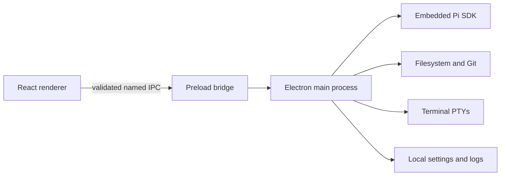

# Architecture and security

Fate UI is a local-first Electron desktop app that embeds the real Pi SDK. Security comes from a hard main/renderer boundary and explicit project trust.

## Process boundary

The renderer has no Node.js, Electron, filesystem, credential, shell, or child-process access. Electron runs with context isolation, sandboxing, web security, denied popup and new-window navigation, and main-frame-only IPC; only trusted renderer audio permission requests are accepted. Project paths are canonicalized and containment-checked in the main process.

- The **main process** owns Pi, credentials, projects, files, Git, terminal PTYs, settings, dialogs, and logs.
- The **preload** exposes only narrow, named, Zod-validated methods and events.
- The **renderer** is presentation-only and must never gain Node, Electron, filesystem, credential, shell, or child-process access.

## Trust model

Every project — opened from the terminal or picked by hand — gets the same **Trust / Open without Pi / Cancel** choice. Project-local resources (for example `.pi/agents`, `.pi` themes) never bypass that decision. The manual terminal remains visually distinct from Pi-generated tool execution.

## Permission model

Fate UI starts Pi in project-confined **Edit files** mode. The active level controls what Pi can touch:

- **Read only** removes project and host mutation tools. If image generation is enabled, `generate_image` can still make a billable provider request and save its output under `~/.pi/agent/generated-images/`; it never writes into the project.
- **Edit files** confines Pi file operations to the active project.
- **Full access** is intentionally unsandboxed and requires explicit confirmation. Pi can then run shell commands and access host paths with your user account's permissions.

Opening another project resets the active Pi permission level. In Agent Teams, descendant permissions can only narrow the caller's authority — see [Agent orchestration](agent-orchestration.md).

## Credentials

Fate UI reuses Pi's existing provider configuration, OAuth sessions, supported environment credentials, and `~/.pi/agent/auth.json`. Raw API keys are never stored or displayed in renderer state.

## Reporting vulnerabilities

Please report vulnerabilities privately according to [SECURITY.md](../SECURITY.md). Do not open a public issue for an unpatched security vulnerability.
