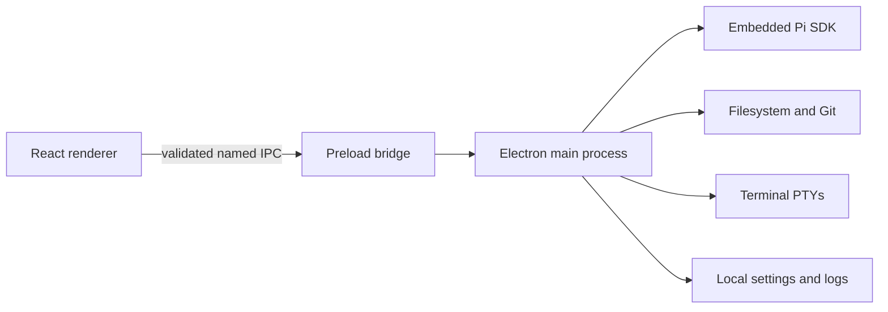

# Architecture and security

Fate UI is a local-first Electron desktop app that embeds the real Pi SDK. Security comes from a hard main/renderer boundary and explicit project trust.

```mermaid
flowchart LR
  R[React renderer] -->|validated named IPC| P[Preload bridge]
  P --> M[Electron main process]
  M --> PI[Embedded Pi SDK]
  M --> FS[Filesystem and Git]
  M --> PTY[Terminal PTYs]
  M --> CFG[Local settings and logs]
```

## Process boundary

The renderer has no Node.js, Electron, filesystem, credential, shell, or child-process access. Electron runs with context isolation, sandboxing, web security, denied popup and new-window navigation, and main-frame-only IPC; only trusted renderer audio permission requests are accepted. Project paths are canonicalized and containment-checked in the main process.

- The **main process** owns Pi, credentials, projects, files, Git, terminal PTYs, settings, dialogs, and logs.
- The **preload** exposes only narrow, named, Zod-validated methods and events.
- The **renderer** is presentation-only and must never gain Node, Electron, filesystem, credential, shell, or child-process access.

## Trust model

Every project — opened from the terminal or picked by hand — gets the same **Trust / Open without Pi / Cancel** choice. Project-local resources (for example `.pi/agents`, `.pi` themes) never bypass that decision. The manual terminal remains visually distinct from Pi-generated tool execution.

## Permission model

New trusted Pi sessions start in project-confined **Edit files** mode. Existing sessions restore valid host-owned grants within the current host limit. The active level controls Fate's governed tools:

- **Read only** removes project and host mutation tools. If image generation is enabled, `generate_image` can still make a billable provider request and save its output under `~/.pi/agent/generated-images/`; it never writes into the project.
- **Edit files** confines Pi file operations to the active project.
- **Full access** is intentionally unsandboxed and requires explicit confirmation. Pi can then run shell commands and access host paths with your user account's permissions.

Permissions belong to the host's project/session record, not to permission claims in conversation text. A missing record uses Edit files. Corrupt or unreadable metadata blocks execution and automatic continuation. Permission writes retain `session-permissions.intent.json` until the grant transaction finishes. A pending, unreadable, or malformed intent blocks fresh stores too; failed storage does not become a Full-access grant.

To recover, stop Fate and inspect both the grant file and intent. Restore a known-good grant state or explicitly review the intended grant before removing the intent, then restart. **Do not delete the intent alone or start an older Fate binary over it:** the grant file can contain an uncommitted higher permission. There is no automatic replay or same-process retry after an incomplete transaction.

Increased effective authority requires a durable save. Reductions fence new higher-authority work and retained governed tool handles, but cannot undo an already running external effect. A failed reduction save may leave an older valid grant on disk; the error must be resolved before relying on the lower level across a restart. The manual terminal and trusted global extension code remain separate host capabilities, not a hostile-code sandbox.

In Agent Teams, descendant permissions can only narrow the caller and host limits. See [Agent orchestration](agent-orchestration.md).

## Credentials

Fate UI embeds `@earendil-works/pi-coding-agent` in the Electron main process. It does not execute or require the `pi` terminal program.

Fate UI stores provider credentials and model configuration under `~/.pi/fateGUI/`. On its first run, it copies existing `~/.pi/agent/auth.json` and `models.json` when present. Settings → MCP → Switch from Pi Terminal can later import only missing provider entries without replacing Fate's values. New Fate profiles also import Pi's default model and thinking level if Fate has no saved settings. Pi sessions, settings, skills, and user extensions remain shared. Fate UI's built-in MCP server list is instead stored in its own provider-independent data root; third-party Pi MCP extensions can still read their own Pi configuration. Supported environment credentials remain available through the Pi SDK. Raw API keys are never stored or displayed in renderer state.

The provider store is private: Fate UI creates its directory with user-only permissions on supported POSIX systems, writes imported credential files with user-only permissions, and refuses a non-regular provider file. Git ignores the mutable provider files for repository-root development overrides. After the first run, Fate UI never silently falls back to Pi Terminal credential or model files; a later import requires an explicit user action.

## Recovery and evidence limits

Saved-session selection uses a streaming, read-only preview instead of rejecting a file because it exceeds 128 MiB. The preview bounds individual records, its entry index, recent visible history, and retained child state. Omitted content has a visible notice; an unreadable newer child snapshot cannot leave an older snapshot looking current. The original JSONL is not truncated or rewritten. On the first new prompt, the Pi SDK reopens the original session and restores its full active-branch context. That live load still retains SDK history in memory and can take substantial memory for very large sessions. Destructive branch rewrites have a separate safety limit; increasing preview capacity does not authorize a larger in-memory rewrite.

Queued and compaction-held drafts use a bounded local outbox. Unacknowledged delivery reopens for review instead of automatically replaying work. SDK acceptance is not proof that a recipient recorded or acted on a message, and exactly-once external effects require tool-level idempotency.

Agent execution, result delivery, and resource cleanup have separate states. A successful task is not rerun merely because its result could not be delivered. A failed-to-stop writer remains tracked with its lease until actual settlement; cancellation errors are surfaced after all requested stop attempts.

Worktree leases coordinate this application runtime, not other processes, external editors, or manual terminals. Outboxes and session records are local plaintext and may include user drafts or attachments. File flushes and atomic replacements mitigate ordinary crashes but do not guarantee recovery from every filesystem or power-loss failure.

Activity path correlation and local SHA-256 records are useful investigation evidence, not cryptographic authorship or tamper-proof audit trails. Automatic model verification does not replace review of important changes. See [GoalMax](goalmax.md), [Agent orchestration](agent-orchestration.md), and [Features](features.md).

## Reporting vulnerabilities

Please report vulnerabilities privately according to [SECURITY.md](../SECURITY.md). Do not open a public issue for an unpatched security vulnerability.
